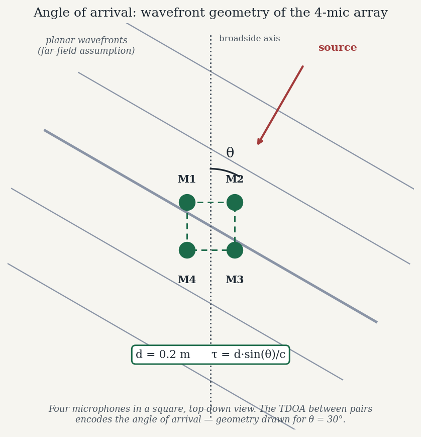

*By [Abdulmalik Ajisegiri](/about)*

> **Companion repository:** [Embedded-Systems-II---AoA-of-Multidirectional-Audio-System](https://github.com/Maleek23/Embedded-Systems-II---AoA-of-Multidirectional-Audio-System)

Point at a sound. Your brain does it without thinking: two ears, a slight delay and level difference between them, and you know roughly where the clap came from. Reproducing that on a microcontroller — with cheap microphones, no operating system, and a power budget — is an excellent embedded systems project precisely because it forces you to confront the physics, the signal processing, and the hardware constraints all at once.

I built an angle-of-arrival (AoA) audio localizer around the TM4C123GH6PM, an ARM Cortex-M4F, using four precision microphones (−44 dBV/Pa sensitivity) with 40 dB gain stages, DMA-fed ADC sampling, and a UART0 virtual COM port feeding a real-time monitoring UI on the host. The goals were accuracy, low cost, and low power — and the design is a study in trade-offs. This article walks through the actual method (time-difference-of-arrival with GCC-PHAT), the embedded realities (why DMA double-buffering is non-negotiable), and the honest limits (reverberation, noise, calibration).

## The problem, geometrically

Angle of arrival means estimating the direction of a sound source from an array of microphones. The core observable is the **time difference of arrival (TDOA)**: a sound wavefront reaches each microphone at a slightly different time, and those differences encode the direction.

Take the simplest case: two microphones separated by distance *d*, and a source far enough away that the incoming wavefront is effectively planar (the far-field assumption). If the source is at angle θ measured from the array's broadside axis, the extra path length to the farther microphone is *d·sin(θ)*, so the time delay between the two mics is:

```
τ = d · sin(θ) / c
```

where *c* ≈ 343 m/s is the speed of sound. Measure τ, invert the relation, and you have θ — up to a front/back ambiguity (θ and 180°−θ give the same delay for a linear pair, which is one reason to use more than two mics arranged in 2D, e.g. four mics in a square or cross, giving azimuth in a plane rather than a cone of confusion).

The entire game, then, is measuring τ accurately between pairs of microphones. That is a signal processing problem.



*The four-mic array from the article, top-down: planar wavefronts (the far-field assumption) reach the microphones in the square at slightly different times, and those time differences encode the angle θ. Geometry drawn for θ = 30°; diagram, not measurement data.*

## Estimating delay: cross-correlation and GCC-PHAT

If mic 1 receives signal x₁(t) and mic 2 receives x₂(t) = x₁(t − τ) plus noise, the textbook delay estimator is the **cross-correlation**: slide one signal past the other and find the lag with maximum similarity. The peak lag *is* the delay, in samples; multiply by the sample period and you have τ in seconds.

Plain cross-correlation works in a quiet room. In the real world, the signals are filtered differently by each mic's position, there's background noise, and — worst of all — **reverberation**: each mic hears the direct sound plus delayed reflections off walls, which create spurious correlation peaks that can be taller than the true one.

The standard fix is **GCC-PHAT** (Generalized Cross-Correlation with Phase Transform). The insight is elegant: the delay information lives in the *phase* of the cross-spectrum, while the amplitude carries the corrupting influence of the room's frequency response and the source spectrum. PHAT whitens the cross-spectrum — divides by its magnitude — so that every frequency bin contributes equally to the delay estimate, regardless of how loud it is:

```
R(τ) = IFFT( X₁(f) · conj(X₂(f)) / |X₁(f) · conj(X₂(f))| )
τ̂  = argmax R(τ)
```

In practice you compute the FFTs of both mic signals, form the normalized cross-spectrum, inverse-FFT back to the time domain, and pick the peak. PHAT dramatically sharpens the true peak relative to reverberation-induced impostors. It's the reason GCC-PHAT is the default TDOA estimator in real localization systems, and it's what I used.

Here's a self-contained numpy sketch of the estimator — the algorithm I'd prototype on the host before ever touching the microcontroller:

```python
import numpy as np

def gcc_phat(x1, x2, fs, max_tau=None):
    """
    Estimate the time delay (in samples) of x2 relative to x1.
    Returns the fractional-sample delay estimate.
    """
    n = 1
    while n < len(x1) + len(x2):
        n *= 2  # next power of two for the FFT

    X1 = np.fft.rfft(x1, n)
    X2 = np.fft.rfft(x2, n)

    cross = X1 * np.conj(X2)
    # PHAT weighting: keep phase, discard magnitude
    cross_phat = cross / (np.abs(cross) + 1e-12)

    r = np.fft.irfft(cross_phat, n)
    # Rearrange so negative lags are interpretable
    r = np.concatenate([r[-(n // 2):], r[:n // 2 + 1]])

    if max_tau is not None:
        center = len(r) // 2
        r = r[center - max_tau : center + max_tau + 1]

    peak = np.argmax(r) - (len(r) // 2)
    return peak  # in samples; divide by fs for seconds

# Example: two mics 0.2 m apart, source at 30 degrees
fs = 16000
d = 0.20
c = 343.0
theta = np.deg2rad(30)
true_tau_s = d * np.sin(theta) / c          # ~291 us
true_tau_samples = true_tau_s * fs          # ~4.7 samples
```

A few things this sketch makes concrete:

- **The delay is only a few samples.** At 16 kHz sampling with 0.2 m mic spacing, a 30° source gives under 5 samples of delay. Sub-sample peak interpolation (parabolic or sinc-based) around the argmax is the difference between coarse and useful angle estimates. This is real and unavoidable: your angular resolution is quantized by your sample clock.
- **`max_tau` is a physical constraint, not a tuning knob.** The maximum possible delay between a mic pair is *d/c* seconds — for 0.2 m spacing, about 583 µs, or ~9.3 samples at 16 kHz. Constraining the peak search to that window rejects absurd peaks from noise. Physics gives you the search bounds for free.
- **PHAT's division needs the epsilon.** Silent frequency bins (division by ~zero) inject garbage; the `1e-12` guard and sensible band-limiting matter in real code.

## The trade-offs that actually bite

Prototyping GCC-PHAT in numpy is the easy part. The project gets interesting when the constraints collide.

**Mic spacing vs. spatial aliasing.** Wider spacing gives larger delays — more samples of τ, better angular resolution. But spacing beyond half a wavelength of the highest frequency of interest causes **spatial aliasing**: the phase wraps, and a single measured delay corresponds to multiple possible angles. For speech-band content up to ~4 kHz (wavelength ≈ 8.6 cm), the alias-free spacing is under ~4.3 cm — yet at that spacing the delays are tiny and resolution suffers. This is the fundamental tension of array design: resolution wants wide, aliasing wants narrow. Four mics help here because multiple baselines (short and long pairs) can be combined — short pairs disambiguate, long pairs refine — but each added pair is more FFTs on a small CPU.

**Sample rate vs. angular resolution vs. compute.** Higher sample rates quantize τ more finely (each sample is a smaller slice of time), directly improving angle resolution. But they also inflate every buffer, every FFT, and the ADC/DMA bandwidth. On a Cortex-M4F running at 80 MHz, you have a real but finite compute budget, and GCC-PHAT is FFT-heavy: two forward FFTs and one inverse per mic pair per frame, with several pairs. The M4F's single-precision FPU is the reason this is feasible at all — fixed-point FFTs would work but the FPU makes the CMSIS-DSP floating-point FFT routines genuinely practical. Still, you size your frame length and FFT size against measured cycle counts, not optimism. This is where the "budget" in the title lives: every extra kilohertz of sample rate and every extra mic pair is paid for in megahertz and milliwatts.

**The analog front end matters more than you'd think.** −44 dBV/Pa mics are quiet; without the 40 dB gain stages, the ADC would be digitizing mostly its own noise floor, and no amount of PHAT whitening recovers signal that isn't there. Gain staging is signal processing too — it sets the SNR that every downstream algorithm inherits. And the four channels must be **gain- and phase-matched**: any inter-channel phase skew looks exactly like a TDOA bias. A constant calibration offset per pair, measured once with a known source position, is the minimum viable fix (more on calibration below).

## Why DMA double-buffering is non-negotiable

Here's the embedded reality that kills naive implementations: the ADC produces samples continuously, and the CPU is busy doing FFTs. If the CPU has to service every ADC sample with an interrupt, at 16 kHz × 4 channels that's 64,000 interrupts per second — each with context-switch overhead — while simultaneously running the DSP chain. You'll drop samples, and dropped samples in a TDOA system are catastrophic: a single missing sample shifts every subsequent delay estimate.

The answer is DMA with **double buffering** (ping-pong): the DMA controller moves ADC conversion results directly into memory with zero CPU involvement. You configure two buffers; the DMA fills one while the CPU processes the other; on buffer completion the DMA raises one interrupt per *buffer* (hundreds of samples) instead of one per sample, and flips to the other buffer.

```c
/* C-style pseudocode for the DMA double-buffer scheme (TM4C123 ADC + uDMA). */
#define FRAME_SAMPLES  512
#define NUM_MICS       4

/* Two frames per channel: DMA writes one, CPU reads the other. */
static int16_t adc_buf[NUM_MICS][2][FRAME_SAMPLES];
static volatile uint8_t ready_buf = 0;   /* which half is full & ready */
static volatile bool frame_ready = false;

/* Configured once at init: ADC sequencer -> uDMA ping-pong transfer
 * into adc_buf[ch][0], then adc_buf[ch][1], auto-alternating. */
void adc_dma_init(void) {
    /* ... ADC sequencer on 4 channels, timer-triggered at fs ... */
    /* ... uDMA channel: source = ADC FIFO, dest = adc_buf, mode = ping-pong ... */
    /* ... enable DMA completion interrupt ... */
}

/* Fires once per frame (512 samples), not once per sample. */
void DMA_IRQHandler(void) {
    ready_buf  = !ready_buf;   /* the just-filled half */
    frame_ready = true;
    /* clear interrupt, DMA already filling the other half */
}

void main_loop(void) {
    adc_dma_init();
    uart0_init();              /* virtual COM port to host UI */

    for (;;) {
        if (frame_ready) {
            frame_ready = false;
            uint8_t b = ready_buf;
            /* Copy out (or process in place) the completed frame,
               then run GCC-PHAT per mic pair on adc_buf[*][b]. */
            int16_t *frame[NUM_MICS];
            for (int ch = 0; ch < NUM_MICS; ch++)
                frame[ch] = adc_buf[ch][b];
            float angle = estimate_angle(frame);  /* GCC-PHAT + geometry */
            uart0_printf("AOA: %.1f deg\r\n", angle);
        }
        /* Optional: sleep/WFI here — the low-power payoff of DMA. */
    }
}
```

Two details worth calling out:

- **The CPU can sleep.** Because DMA owns the data movement, the main loop can execute wait-for-interrupt between frames. This is where the low-power objective is actually won or lost — not in a "low power mode" checkbox, but in the architecture that lets the CPU be idle most of the time. An interrupt-per-sample design can never sleep; a DMA design sleeps between frames.
- **Buffer sizing is a latency/robustness trade.** Larger frames mean fewer interrupts and more efficient FFTs (power-of-two sizes), but they also mean higher latency from sound to angle estimate and more RAM. On a TM4C123 with 32 KB SRAM, four channels × two buffers × 512 samples × 2 bytes = 8 KB just for raw audio — a quarter of RAM before a single FFT twiddle factor. You feel every byte.

The UART0 virtual COM port completes the loop: real-time angle estimates and diagnostics stream to a host-side monitoring UI over USB. That UI isn't a luxury — when you're debugging why the angle reads 40° for a source at 30°, watching raw per-pair delay estimates live is how you discover it's a phase mismatch on channel 3, not a math error.

## Honest limits

**Reverberation** is the dominant error source indoors. GCC-PHAT suppresses it but doesn't eliminate it; strong early reflections from a nearby wall can still win the peak vote, especially for transient sounds (claps, knocks) where the direct path doesn't dominate the frame. The far-field plane-wave assumption also degrades for close sources — the wavefront is spherical, and the simple *d·sin(θ)/c* inversion gains bias.

**Noise** sets the floor. PHAT whitens the spectrum, which means it *amplifies* the contribution of noisy bins — in very low SNR, PHAT can perform worse than plain cross-correlation. Real systems gate on signal energy or SNR before trusting an estimate, and a "no confident estimate" output is a feature, not a failure.

**Calibration** is the unglamorous remainder. Mic positions are never exactly as designed (a millimeter of placement error is ~3 µs, ~0.05 samples at 16 kHz — small, but it biases every estimate systematically), gain stages differ slightly, and the ADC channels can have tiny skews. A one-time calibration with a source at known angles, storing per-pair offset corrections, moves the system from "approximately right" to "actually right." Skip it and you'll chase algorithmic ghosts for a phantom hardware bias.

## Tying it back to engineering practice

This project is a compact lesson in a pattern that shows up everywhere in engineering: **the algorithm is the easy 20%**. GCC-PHAT fits in a dozen lines of numpy. The other 80% is the unglamorous work the algorithm silently assumes — clean gain-staged analog input, sample-exact multichannel capture via DMA, buffers sized against real RAM, compute budgeted against real megahertz, and a calibration procedure that absorbs the hardware's imperfections. Every DSP textbook presents the estimator; none of them hand you continuous, aligned, calibrated samples. Building the whole chain teaches you to ask, of any algorithm, the question that actually matters: *what does this assume about its inputs, and who guarantees those assumptions?* On a Cortex-M4, the answer is you — the DMA controller, the linker script that placed your buffers, and the calibration routine you wrote on a Sunday. That habit of tracing an algorithm's assumptions down to the hardware is the most transferable skill embedded work teaches, and it applies just as well to a server-side ML pipeline as to four microphones on a breadboard.

## Related reading

- [DMA Double-Buffering for Continuous Sensor Capture](/research/dma-double-buffering-sensor-capture/)
- [Low-Power Embedded Design on the TM4C123: Hibernation, EEPROM Persistence, and a UART CLI That Validates Everything](/research/low-power-embedded-design-tm4c123/)
