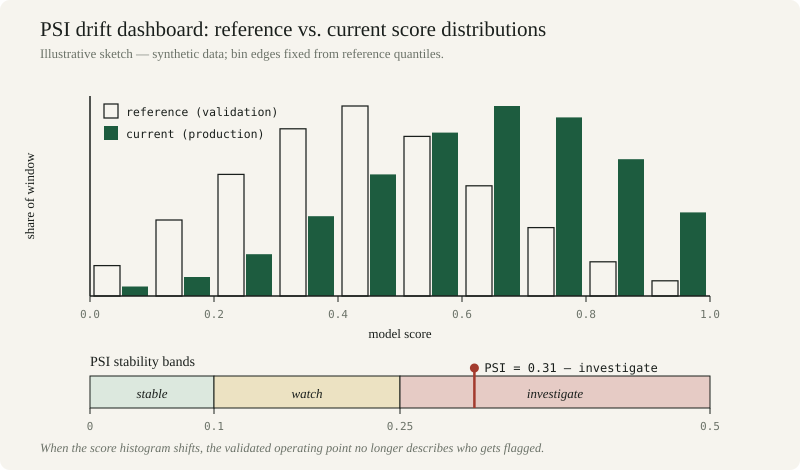

*By [Abdulmalik Ajisegiri](/about)*

*All datasets in the code below are synthetic stand-ins generated with NumPy's `default_rng` — patterns to copy, not measurements from any real system. No production data, employer model, or client is described here.*

## Models rot

Every model in production is a bet that the future will resemble the past in the specific ways the model depends on. That bet has an expiration date. Customer behavior shifts, competitors adapt, economies cycle, and — most corrosively — the model's own predictions change the environment it was trained on. Decay is not an edge case; it is the default trajectory of any model deployed into a living world.

Validation at launch answers "is this model fit for use *now*?" Monitoring answers "is it still fit *today*?" Organizations that treat validation as a one-time gate and monitoring as an afterthought discover decay the expensive way: when stakeholders, regulators, or customers notice first.

## Population stability: the PSI

The earliest warning of decay usually appears in the inputs, not the outputs. Population stability metrics compare the distribution of incoming production data against the distribution the model was validated on — and they work before a single outcome label arrives.

The workhorse is the **Population Stability Index (PSI)**: bin a feature's values using quantile breaks from the *reference* distribution, then sum, across bins, the difference between expected and actual proportions weighted by the log of their ratio. Industry convention reads PSI below 0.1 as no significant change, 0.1–0.25 as a shift worth investigating, and above 0.25 as a significant shift demanding action. Conventions, not laws — calibrate them to each feature's importance and the model's sensitivity to it.

Two implementation details decide whether your PSI is honest. First, **bin edges must come from the reference window**; re-binning on current data re-centers the ruler on the drift you're hunting and the shift disappears. Second, **run PSI on the model score, not just the features**: score drift means the decision boundary is firing on a different population than the one it was validated on, and it is usually the most sensitive single canary you have.

```python
import numpy as np

# --- Synthetic data: reference vs. current windows (illustrative stand-in) ---
rng = np.random.default_rng(7)
N_FEATURES = 6
ref = rng.normal(0, 1, size=(5000, N_FEATURES))        # "validation window"
cur = rng.normal(0, 1, size=(1500, N_FEATURES))        # "production window"
cur[:, 2] = rng.normal(0.45, 1.2, size=1500)           # synthetic drift injected in feature_02
score_ref = rng.normal(0.20, 0.10, size=5000)
score_cur = rng.normal(0.27, 0.11, size=1500)          # score distribution drifts too
```

```python
def psi(expected, actual, bins=10, eps=1e-4):
    """Population Stability Index. <0.1: stable; 0.1-0.25: watch; >0.25: investigate."""
    breaks = np.unique(np.quantile(expected, np.linspace(0, 1, bins + 1)))
    e_counts, _ = np.histogram(expected, bins=breaks)
    a_counts, _ = np.histogram(actual, bins=breaks)
    e_perc = np.clip(e_counts / e_counts.sum(), eps, None)
    a_perc = np.clip(a_counts / a_counts.sum(), eps, None)
    return np.sum((a_perc - e_perc) * np.log(a_perc / e_perc))

for j in range(N_FEATURES):
    v = psi(ref[:, j], cur[:, j])
    verdict = "STABLE" if v < 0.1 else ("WATCH" if v < 0.25 else "INVESTIGATE")
    print(f"feature_{j:02d}  PSI={v:.3f}  {verdict}")
print(f"model score   PSI={psi(score_ref, score_cur):.3f}")
```



*Figure — a PSI drift dashboard: binned reference vs. current distributions, with the 0.1/0.25 threshold bands and an illustrative breach marker.*

## Beyond PSI: the drift battery

PSI is a workhorse, not a complete stable. No single metric sees every kind of drift, so the monitoring suite should be deliberately redundant:

- **Kolmogorov–Smirnov** for continuous features: the maximum gap between empirical CDFs. Sensitive to any distributional change, with no binning choices to argue about.
- **Chi-square tests** for categorical features: observed vs. expected category counts. Catches mix shifts — a channel or segment rebalancing — that continuous metrics never see.
- **Means, variances, and missingness rates**: the boring checks that catch what the fancy metrics miss. A feature whose mean is steady but whose missing rate tripled is telling you the pipeline changed, not the world.
- **Score-distribution monitoring**: PSI or KS on the model's own output scores, plus the flag rate. When the flag rate moves and nobody changed a threshold, the population moved.

```python
from scipy import stats

# KS: continuous drift, no binning choices
ks = stats.ks_2samp(ref[:, 0], cur[:, 0]).statistic
print(f"KS statistic, feature_00 (stable by construction): {ks:.3f}")

# chi-square: categorical mix shift
ref_cat = rng.choice(["a", "b", "c"], size=5000, p=[0.5, 0.30, 0.20])
cur_cat = rng.choice(["a", "b", "c"], size=1500, p=[0.42, 0.33, 0.25])  # synthetic mix shift
table = np.array([[(ref_cat == k).sum() for k in "abc"],
                  [(cur_cat == k).sum() for k in "abc"]])
print(f"chi-square p-value, categorical mix: {stats.chi2_contingency(table).pvalue:.4f}")

# moments: the boring check that catches pipeline changes
print(f"feature_03 mean: ref={ref[:, 3].mean():.3f} cur={cur[:, 3].mean():.3f}")
print(f"feature_03 std:  ref={ref[:, 3].std():.3f} cur={cur[:, 3].std():.3f}")
```

## Performance monitoring: signal vs. noise

Drift in realized performance is harder to read than drift in inputs, because performance metrics are noisy. A weekly accuracy dip might be decay or a bad week. Four disciplines separate the two:

**Confidence intervals around every metric.** Never report a point estimate without its uncertainty. If this week's interval overlaps last quarter's, the honest verdict is "we don't know yet" — and that is a legitimate monitoring output. Wilson intervals behave well for rates even at small n:

```python
import pandas as pd

# --- Synthetic weekly outcomes (illustrative stand-in) ---
weeks = pd.DataFrame({"week": range(1, 13),
                      "n": rng.integers(800, 1200, size=12)})
true_acc = np.linspace(0.86, 0.79, 12)      # synthetic decay: 86% -> 79%
weeks["correct"] = rng.binomial(weeks["n"], true_acc)

def wilson(p_hat, n, z=1.96):
    den = 1 + z**2 / n
    center = p_hat + z**2 / (2 * n)
    margin = z * np.sqrt(p_hat * (1 - p_hat) / n + z**2 / (4 * n**2))
    return (center - margin) / den, (center + margin) / den

weeks["acc"] = weeks["correct"] / weeks["n"]
weeks[["lo", "hi"]] = weeks.apply(
    lambda r: wilson(r["acc"], r["n"]), axis=1, result_type="expand")
print(weeks[["week", "n", "acc", "lo", "hi"]].round(3).to_string(index=False))
```

**Sequential discipline.** Monitoring re-tests the same hypothesis every week, and standard significance tests assume a fixed sample — re-testing inflates false alarms mechanically. Use sequential or group-sequential methods built for repeated looks (alpha-spending functions, CUSUM-style cumulative deviation charts), or at minimum require a breach to persist across consecutive windows before it counts.

**Segmented analysis.** Aggregate metrics hide localized failure. Slice performance by segment, geography, channel, or time cohort — decay usually starts in one corner and spreads. A model whose global accuracy is flat while one segment collapses is not healthy; it is averaging.

**A challenger as canary.** Keep a simple challenger model scoring in shadow. If the challenger's performance holds while production degrades, the problem is in the production model's assumptions, not the world — and you already have a fallback candidate.

## Retraining triggers: from alert to action

An alert is a question; a retraining trigger is an answer decided in advance. Define, before deployment, which response each breach earns:

- **Recalibrate** when discrimination holds but calibration drifted: refit the probability mapping (Platt scaling, isotonic regression) on fresh labeled data. Cheap, fast, and often enough.
- **Refit** when the feature relationships shifted but the feature set is still right: retrain the same model class on a recent window. Watch for the trap — refitting on data the old model selected (approvals only, survivors only) bakes selection bias into the new model.
- **Rebuild** when the world changed shape: new segments, new channels, concept drift the old features cannot express. This is a new validation cycle, not a patch.
- **Retire** when no retraining earns its keep: the challenger wins, the use case evaporated, or the cost of being wrong now exceeds the value of being right.

Triggers should be explicit and disjunctive — whichever fires first: a sustained PSI breach on key features or the score, a performance drop beyond the red threshold, a base-rate shift in the outcome, or elapsed time since the last validation. "Elapsed time" matters because some decay is invisible to every metric until labels arrive; a model that has never been revalidated in two years is not stable, it is unexamined.

## Alerting without the pager fatigue

Monitoring without response is instrumentation theater; alerting without discipline is a pager nobody answers. Every metric gets a tier, an owner, and a pre-approved response — documented at setup, not negotiated during an incident:

```python
# --- Monitoring policy: owner, threshold, response — decided up front (illustrative) ---
MONITORING_POLICY = {
    "psi_features":  {"yellow": 0.10, "red": 0.25, "owner": "model owner",
                       "yellow_sla": "triage within 1 business day, written disposition",
                       "red_action": "restrict use; revalidate before full deployment"},
    "psi_score":     {"yellow": 0.10, "red": 0.25, "owner": "model owner",
                       "yellow_sla": "triage within 1 business day, written disposition",
                       "red_action": "freeze automated decisions; manual review queue"},
    "accuracy_drop": {"yellow": 0.02, "red": 0.05, "owner": "model owner",
                       "yellow_sla": "segmented analysis within 1 business day",
                       "red_action": "challenger comparison; retrain-or-retire decision"},
}
```

**Yellow triggers investigation**, with a defined SLA and a written disposition even when the verdict is "noise." The disposition log is the point: months later it is the evidence the model was being watched. **Red triggers containment** — use restrictions, score caps, manual review queues — while the root cause is diagnosed. Pre-approved containment matters because in a real incident nobody should be inventing the response.

Two rules keep the pager honest. **Alert on persistence, not spikes**: require a breach across consecutive windows so one bad week doesn't page anyone. **Review the thresholds yearly**: a threshold that never fires is decoration; one that fires weekly is noise. Both are miscalibrated instruments, not vigilance.

## Feedback loops and reflexivity

The most dangerous decay mechanism is the one the model creates itself. A deployed model alters the environment it predicts: a credit model that approves safer borrowers changes its own applicant pool; fraud models train fraudsters; denying someone *because of* a low score changes their trajectory and contaminates the ground truth. Training data becomes progressively less representative of the deployment environment *because of* the deployment.

The countermeasures are structural: holdout groups excluded from model-driven decisions, periodic challenger evaluation, and causal monitoring that tracks not just what the model predicts but what would have happened without it. If you cannot measure the model's effect on its own inputs, you cannot distinguish decay from success.

## What a good monitoring dashboard shows

One dashboard serves three audiences if it is layered. The **health layer** answers "is it healthy?" for the model owner: traffic lights on input stability, score distribution, performance vs. expectation, and pipeline freshness — glanceable in thirty seconds. The **diagnostic layer** answers "is it still valid?" for the validator: PSI by feature, segmented performance, drift test statistics, challenger comparisons — enough to triage without opening a notebook. The **forensic layer** supports root-cause analysis: raw series, drill-downs, prediction-level audit trails, and event annotations for deployments, pipeline changes, and market events.

Underneath all three, keep a **monitoring log**: every alert, disposition, and action, timestamped. When a regulator or auditor asks what ongoing monitoring looked like, "the dashboard was green" is not an answer; the log is.

Decay is inevitable. Surprise is optional.

## Related

- [Model Risk & Validation](/model-risk)
- [Validating Models Like a Skeptic: The Outcomes-Analysis Playbook](/research/validating-models-like-a-skeptic)
- [Building an LLM Evaluation Harness: BLEU, ROUGE, SBERT, and Risk Tagging](/research/llm-evaluation-harness-bleu-rouge-sbert)
