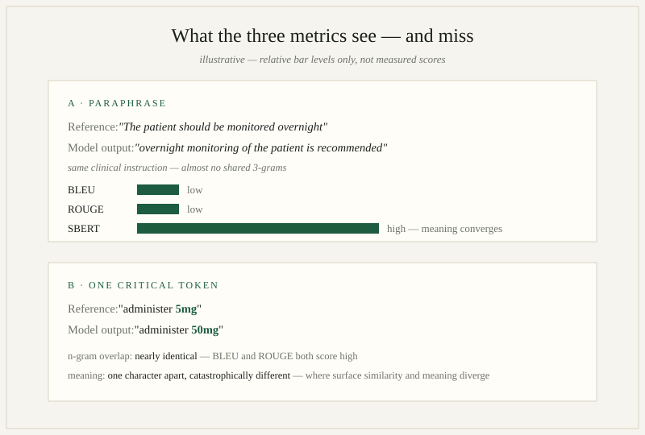
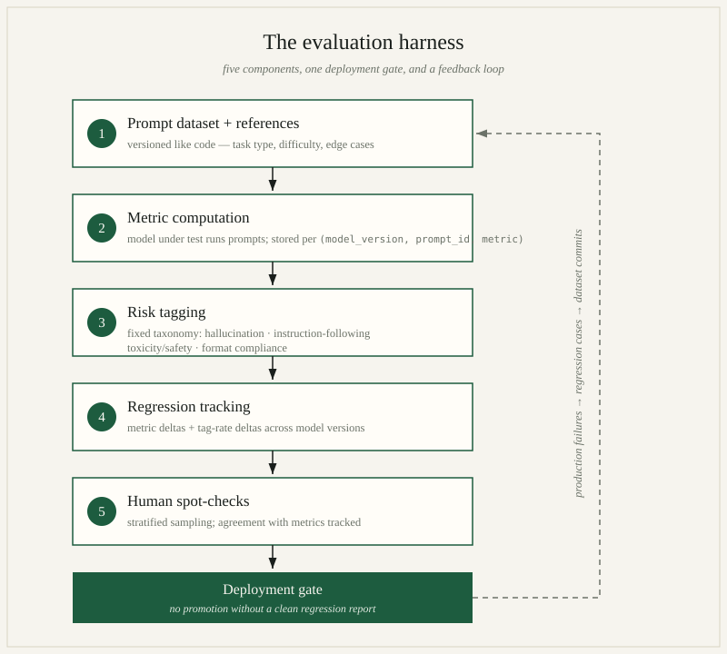

*By [Abdulmalik Ajisegiri](/about)*

*Note: this is a general technical how-to. It describes how to build an LLM evaluation harness from public tools and methods — not a description of any shipped product or employer system.*

"Our new model scores higher" is not an evaluation strategy. LLM outputs are open-ended, failure modes are semantic rather than syntactic, and the same prompt can produce a brilliant answer on Tuesday and a confident fabrication on Wednesday. Without a harness — a repeatable pipeline that runs prompts, scores outputs, tags failures, and tracks regressions across model versions — you're flying blind, and every model swap is a gamble.

This article builds that harness from first principles: what the three workhorse metrics actually measure, where each one lies to you, and the architecture around them that turns raw scores into something you can govern.

## What the metrics actually measure

### BLEU: precision-oriented n-gram overlap

BLEU (originally from machine translation) asks: *of the n-grams the model produced, what fraction appear in the reference?* That's precision. It computes modified n-gram precision for n = 1..4, takes the geometric mean, and multiplies by a **brevity penalty** that punishes outputs shorter than the reference (otherwise "the" would score perfectly on unigram precision).

What it measures well: surface-level fidelity — did the model produce the expected terminology, in roughly the expected phrasing? Useful for constrained generation: code, structured extractions, translations of formulaic text.

Where it lies: BLEU is blind to paraphrase. "The patient should be monitored overnight" and "overnight monitoring of the patient is recommended" convey the same clinical instruction and share almost no 3-grams. BLEU also rewards safe, generic phrasing and punishes correct answers worded differently from your one reference. It has no notion of meaning — only of token sequences.

### ROUGE: recall-oriented n-gram overlap

ROUGE (from summarization) flips the question: *of the n-grams in the reference, what fraction did the model produce?* That's recall. ROUGE-N counts n-gram overlap; ROUGE-L uses the longest common subsequence, which rewards preserving word order without requiring exact contiguity.

What it measures well: coverage — did the output include the key content of the reference? Good for summarization and anywhere omission is the dominant failure mode.

Where it lies: ROUGE is trivially gamed by verbosity. A model that dumps the entire reference plus three paragraphs of filler scores high on recall. It also can't distinguish "administer 5mg" from "administer 50mg" any more than BLEU can — one character of difference, catastrophic semantic difference, nearly identical n-gram overlap. Negation, numbers, and units are where n-gram metrics fail most dangerously, because those are exactly the tokens where surface similarity and meaning diverge.

### SBERT cosine similarity: semantic similarity

Sentence-BERT embeds the output and the reference into a dense vector space and measures the cosine of the angle between them. What it measures: *meaning* proximity as learned from natural language inference training — paraphrases score high, contradictions and topic drift score low, regardless of surface wording.

What it measures well: the thing BLEU and ROUGE miss. Two differently-worded correct answers converge; a fluent hallucination that shares vocabulary with the reference but asserts something different diverges — at least when the semantic difference is large enough for the embedding space to resolve.

Where it lies: cosine similarity is a blunt instrument. Scores live in a compressed range (most unrelated sentence pairs sit around 0.3–0.6, not near zero), so raw numbers need calibration against your own data — never interpret 0.82 as "82% correct." Embeddings also inherit the biases and blind spots of their training: they can rate a fluent, on-topic hallucination as highly similar to the reference because it *sounds* right. And like all three metrics, SBERT compares against your reference — if the reference is wrong or incomplete, high similarity means faithfully reproducing the wrong answer.

**The honest summary:** BLEU tells you about precision of phrasing, ROUGE about recall of content, SBERT about semantic closeness. None of them tells you whether the answer is *true*, *safe*, or *useful*. That's what the rest of the harness is for.


*Figure — what each metric sees and misses, shown with the article's own example pairs.*

## Harness architecture

A real evaluation harness has five components. The metrics are only one of them.

**1. Prompt dataset + references.** A versioned set of prompts covering your actual use cases, each with one or more reference outputs and metadata: task type, difficulty, known edge cases. Version it like code — when you add regression cases from production failures, that's a dataset commit. Aim for coverage of the failure modes you fear, not just the happy path.

**2. Metric computation.** Run every prompt against the model under test, compute the full metric suite per output, and store results per (model_version, prompt_id, metric). Deterministic seeds where the API allows; multiple samples per prompt when you're measuring variance, not just point quality.

**3. Risk/failure tagging taxonomy.** Metrics catch gradations; tags catch categories. Every output gets classified against a fixed taxonomy — mine is: **hallucination** (asserts false or unverifiable facts), **instruction-following** (ignores format, length, or content constraints), **toxicity/safety** (harmful, biased, or disallowed content), and **format compliance** (valid JSON? correct schema? parseable?). Tags can come from rules (schema validation), classifiers (toxicity detectors), LLM-as-judge with a strict rubric, or human review. The taxonomy is fixed across model versions — that's what makes regressions comparable.

**4. Regression tracking across model versions.** Every model change — new weights, new system prompt, new temperature — gets a full harness run, and the dashboard shows metric deltas and tag-rate deltas per category. A +2 BLEU improvement that comes with a doubled hallucination tag rate is not an improvement. Gate deployments on this: no promotion without a clean regression report.

**5. Human spot-check sampling.** Automated metrics drift from human judgment; the harness needs a calibration loop. Sample outputs stratified by risk — oversample low-metric-score outputs, high-stakes task types, and anything the taggers flagged — and have humans score them on the dimensions that matter (correctness, safety, usefulness). Track agreement between automated metrics and human scores over time. When they diverge, it's the metrics that are wrong until proven otherwise.


*Figure — the five harness components, the deployment gate, and the production feedback loop.*

## The code: metric computation core

Here's a working core using `sacrebleu` (standardized, tokenization-controlled BLEU — never use raw NLTK BLEU in a harness; tokenization differences make scores incomparable), `rouge-score`, and `sentence-transformers`:

```python
from dataclasses import dataclass, field
import numpy as np
import sacrebleu
from rouge_score import rouge_scorer
from sentence_transformers import SentenceTransformer


@dataclass
class EvalCase:
    prompt_id: str
    references: list[str]          # one or more acceptable references
    task_type: str                 # e.g. "summarization", "extraction", "qa"
    risk_tier: str = "standard"    # "standard" | "high" — drives spot-check sampling


@dataclass
class MetricResult:
    prompt_id: str
    bleu: float
    rouge1_f: float
    rougeL_f: float
    sbert_cosine: float
    tags: list[str] = field(default_factory=list)


class MetricSuite:
    def __init__(self, sbert_model: str = "all-MiniLM-L6-v2"):
        self.rouge = rouge_scorer.RougeScorer(["rouge1", "rougeL"], use_stemmer=True)
        self.sbert = SentenceTransformer(sbert_model)

    def score(self, case: EvalCase, hypothesis: str) -> MetricResult:
        # sacrebleu: one hypothesis, one reference *stream* per reference
        # (each stream holds exactly one ref per hypothesis)
        bleu_score = sacrebleu.corpus_bleu(
            [hypothesis],
            [[ref] for ref in case.references],
        )
        bleu = bleu_score.score / 100.0
        signature = bleu_score.format()  # log this: tokenization is part of the score

        # rouge: score against the best-matching reference
        rouge_scores = [self.rouge.score(ref, hypothesis) for ref in case.references]
        best = max(rouge_scores, key=lambda s: s["rougeL"].fmeasure)

        # SBERT: max cosine over references (credit the closest acceptable answer)
        hyp_emb = self.sbert.encode(hypothesis, normalize_embeddings=True)
        ref_embs = self.sbert.encode(case.references, normalize_embeddings=True)
        cosine = float(np.max(ref_embs @ hyp_emb))

        return MetricResult(
            prompt_id=case.prompt_id,
            bleu=bleu,
            rouge1_f=best["rouge1"].fmeasure,
            rougeL_f=best["rougeL"].fmeasure,
            sbert_cosine=cosine,
        )
```

A few deliberate choices worth noting:

- **Multiple references, max-aggregation.** Real tasks have many acceptable answers. Scoring against one reference punishes legitimate variation; taking the best score across references is the standard fix.
- **`sacrebleu` over hand-rolled BLEU.** BLEU scores are meaningless without a declared tokenization. `sacrebleu` bakes the tokenization into a versioned signature string — log `bleu.format()` alongside the score or your numbers aren't reproducible.
- **Normalized embeddings for cosine.** With `normalize_embeddings=True`, cosine similarity reduces to a dot product — no silent magnitude effects.
- **Tags are separate from metrics.** The `tags` field is populated by a different stage (rules, classifiers, judges, humans). Keeping metric computation and risk tagging as distinct pipeline stages means you can re-run tagging logic over stored outputs without re-running the model — cheap, and essential when your taxonomy evolves.

The regression layer on top is straightforward but non-negotiable: persist every `MetricResult` with `(model_version, timestamp)`, then diff. The report that gates a deployment isn't "average BLEU went up" — it's per-task-type metric deltas plus per-category tag-rate deltas, with statistical noise accounted for (bootstrap confidence intervals on the deltas; a 1-point BLEU move on 50 prompts is noise, not signal).

## The governance frame: what the harness doesn't cover

The harness gives you evidence. Evidence needs a frame that decides what happens next — otherwise the regression report is just a document nobody reads before shipping. The relevant frame is model-risk management, and a few of its lessons apply directly:

**Passing the harness is not the same as eliminating risk.** Model risk is the potential for adverse consequences from decisions based on the model's outputs; the harness is one control against it. A clean regression report reduces uncertainty; it doesn't remove it. The residual risk — the failure modes your prompt dataset doesn't cover, the high-stakes use cases your tags can't adjudicate, the world changing under your references — has to be owned explicitly: named, assigned to someone, and tracked. If your deployment process treats a green dashboard as "risk handled," you've confused the control for the thing it controls.

**Independence matters.** The spot-check loop works best when the humans scoring outputs aren't the same people who tuned the model — validators need to be free from the incentives of the development team. Same for the taxonomy: whoever wrote the system prompt shouldn't be the sole judge of whether the hallucination tag rate is "acceptable."

**Define revalidation triggers up front.** Every model change gets a full harness run — but what counts as a model change? New weights, new system prompt, new temperature, *new data feeding your prompts*: write down the triggers for revalidation, plus the metric and tag-rate thresholds that block a deployment. Continuous retraining or frequent prompt edits don't exempt you; they mean you're validating the *process* rather than a single snapshot, and monitoring more aggressively between versions.

**Watch the LLM-specific failure modes the traditional mold misses.** Traditional validation assumed an interpretable model with a stable specification. LLM deployments strain that in predictable ways: the training data effectively *is* the specification, so dataset versioning and leakage controls are first-class validation activities, not preprocessing chores; continuous prompt/model updates mean there's no single "validation event" to point at; and emergent behaviors have no historical precedent for backtesting to cover. None of this makes the discipline obsolete — it makes mechanical compliance insufficient. A harness that checks the boxes without adapting to how generative models actually fail is the kind of validation that passes audits and misses risks.

## Closing the loop: why this is model-risk management

Strip away the NLP specifics and this harness is doing exactly what formal model-risk practice demands. In the language of SR 11-7 — the Federal Reserve's model-risk guidance, built on conceptual soundness, ongoing monitoring, and outcomes analysis:

- The **prompt dataset and metric definitions** are conceptual soundness: a documented statement of what the model is supposed to do and how you'll know.
- **Regression tracking across versions** is ongoing monitoring: the model's behavior is re-verified every time it changes, not just at launch.
- **Human spot-checks and tag-rate analysis** are outcomes analysis: comparing model behavior against ground truth (human judgment) and investigating where it diverges.

That mapping isn't academic. It means an LLM harness isn't a nice-to-have engineering accessory — it's the control that lets you deploy generative models the way regulated industries deploy any other model: with evidence, with version-to-version comparability, and with a defined point at which a human says "this change is safe to ship." The metrics tell you *what changed*. The tags tell you *whether it matters*. The humans tell you *whether to believe either of them*. Build all three, version everything, and gate on the report — that's evaluation as risk management, not evaluation as leaderboard.

## Related reading

- [Validating Models Like a Skeptic: The Outcomes-Analysis Playbook](/research/validating-models-like-a-skeptic/)
