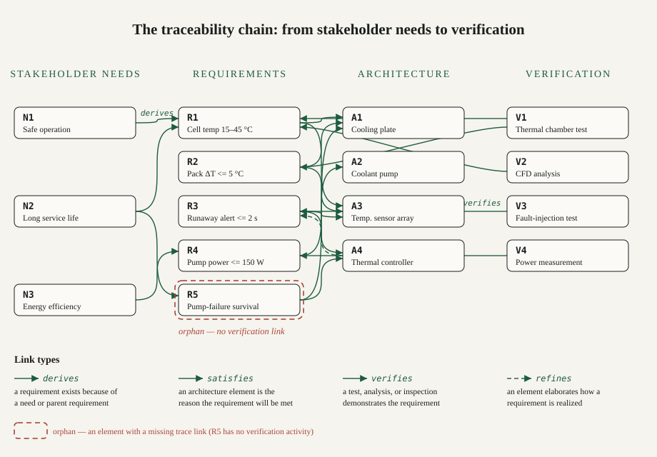

*By [Abdulmalik Ajisegiri](/about)*

The promise of Model-Based Systems Engineering is that the model becomes the reasoning engine: ask it "what breaks if this requirement changes?" and it answers. The mechanism that makes that possible is traceability — explicit, typed links between needs, requirements, architecture, and verification. Without them the model is a prettier document sprawl. With them it earns its keep.

This article is about the method: what the trace chain looks like, the link types that carry meaning, how to read and query a trace matrix, and the process failures that rot traceability in practice. The running example is a toy battery-thermal subsystem invented to show the mechanics — it is illustrative, not a description of any real system.

## What MBSE actually is

Model-Based Systems Engineering is the shift from document-centric to model-centric systems engineering. Instead of the system's definition living in scattered documents — Word specs, Visio diagrams, spreadsheets that drift out of sync the moment they're written — the definition lives in a **system model**: a coherent, machine-readable representation of requirements, structure, behavior, and parameters, typically expressed in SysML or UML.

The model becomes the single source of truth. Documents and diagrams are generated *views* of the model rather than independent artifacts. When a requirement changes, the change propagates through the model: the architecture elements that satisfy it are flagged, the verification activities that cover it are marked stale, the stakeholders impacted are identifiable. That propagation — not the diagrams — is the actual value of MBSE.

None of this requires exotic tooling to understand, but it does require a conceptual shift: the team stops editing *descriptions* of the system and starts maintaining *a model of* the system. The model is the work product.

## Why traceability is the backbone

Requirements traceability is the ability to follow relationships between requirements and everything they connect to: stakeholder needs above them, architecture and design elements below them, verification activities that prove them, and sibling requirements they constrain or conflict with. In an MBSE context, these relationships are modeled explicitly as relationships between model elements — not maintained by hand in a spreadsheet column.

Traceability is the backbone because it is what makes the model *actionable*:

- **Change impact analysis.** A requirement changes; traceability answers "what else changes?" without a forensic document hunt.
- **Coverage proof.** Traceability answers "is every stakeholder need addressed?" (forward trace) and "does every requirement trace to a real need?" (backward trace). Untraced requirements in either direction are suspect — the first kind is unvalidated scope, the second is scope creep.
- **Verification planning.** Each requirement traces to verification activities that demonstrate it. When the architecture changes, the trace shows exactly which verification evidence must be re-earned.
- **Defensibility.** Audits, safety cases, and design reviews all ask the same question in different forms: "show me that this design satisfies these needs." A complete trace is the answer, machine-checkable.

Without traceability, an MBSE model is a prettier version of the document sprawl it replaced. With it, the model is a reasoning engine.

## The trace chain: needs to verification

The canonical trace chain runs end to end:

1. **Stakeholder needs.** What the stakeholders actually want, in their language. Needs are not requirements — they are the problem statement the requirements will address.
2. **System requirements.** The formal, verifiable statements the system must satisfy. Each requirement should trace to at least one need it serves (and needs with no derived requirements are gaps in the definition).
3. **Architecture.** Logical and physical decomposition — functions, components, interfaces. Each architecture element exists to satisfy specific requirements; elements that satisfy nothing are unjustified mass, cost, and complexity.
4. **Design.** The detailed realization of the architecture. Trace here is finer-grained: parameters, interfaces, tolerances linked to the requirements that constrain them.
5. **Verification.** The tests, analyses, inspections, and demonstrations that prove each requirement is met. Every requirement must trace to at least one verification activity, and the verification plan is complete when the trace has no orphans.

Two directions matter. **Forward trace** (need → requirement → architecture → verification) proves coverage. **Backward trace** (verification → requirement → need) proves necessity. Teams that only maintain one direction discover the gap during the audit they were preparing for.



*Figure — the traceability chain across needs, requirements, architecture, and verification, with typed links and one orphan requirement (R5) waiting on verification coverage.*

## The five link types that actually matter

A trace link should carry its meaning — *satisfies*, *verifies*, *derives from*, *refines* — not just "related to." Semantics make automated impact analysis possible; unlabeled links are decoration. SysML gives this vocabulary standard names; the table below states them generically, the way they behave in any model:

| Link type | Reads as | Direction | Why it matters |
|---|---|---|---|
| **derive** | R2 is derived from R1 | requirement → requirement | Captures decomposition: a subsystem requirement exists because a system requirement demanded it |
| **refine** | A4 refines R3 | model element → requirement | Records that an element elaborates *how* a requirement is realized, beyond the requirement's own text |
| **satisfy** | A1 satisfies R1 | architecture/design → requirement | The core allocation claim: this element is why the requirement will be met |
| **verify** | V1 verifies R1 | verification activity → requirement | The evidence claim: this activity demonstrates the requirement is met |
| **trace** | *general dependency* | any → any | The fallback for relationships with no sharper type; overuse here is a smell |

The rule of thumb: if an impact query can't distinguish "this architecture element exists because of this requirement" from "this test happens to mention this requirement," the link types aren't doing their job. Type the links when they're created, not when they're needed — by then it's archaeology.

## A toy example, end to end

*The following subsystem and its requirements are fully illustrative — invented to demonstrate traceability mechanics, not describing any real system or project.*

Take a battery thermal-management subsystem with three stakeholder needs:

- **N1** — the pack must operate safely under all driving conditions.
- **N2** — the pack must last the vehicle's service life.
- **N3** — thermal management must not waste significant energy.

From these, five verifiable requirements are derived (note the shape: each is singular, unambiguous, and testable — requirements must pass quality gates *before* they're traced):

- **R1** — the subsystem shall maintain cell temperature between 15 °C and 45 °C during operation. *(derives from N1, N2)*
- **R2** — the subsystem shall limit the maximum temperature gradient across the pack to 5 °C. *(derived from R1)*
- **R3** — the subsystem shall detect thermal-runaway precursors and alert the battery controller within 2 seconds. *(derives from N1)*
- **R4** — the subsystem shall keep coolant-pump power below 150 W in nominal operation. *(derives from N3)*
- **R5** — the subsystem shall survive a 30-minute coolant-pump failure without cell temperature exceeding 60 °C. *(derives from N1, N2)*

The architecture decomposes into four elements: **A1** cooling plate, **A2** coolant pump, **A3** temperature sensor array, **A4** thermal controller. Verification activities: **V1** thermal-chamber test, **V2** CFD analysis, **V3** sensor fault-injection test, **V4** power measurement. The satisfy and verify links connect them exactly as the diagram above shows — and notice **R5 has no verification activity yet**. That orphan is not a formatting detail; it is the single most important fact the model knows about this subsystem.

## Reading a trace matrix

A traceability matrix is a *report the model produces*, not a spreadsheet someone maintains. Read it as a coverage audit. For the toy subsystem:

| Requirement | Derives from | Satisfied by | Verified by | Status |
|---|---|---|---|---|
| R1 — cell temp 15–45 °C | N1, N2 | A1, A3 | V1, V2 | covered |
| R2 — pack ΔT ≤ 5 °C | R1 | A1, A3 | V1 | covered |
| R3 — runaway alert ≤ 2 s | N1 | A3, A4 | V3 | covered |
| R4 — pump power ≤ 150 W | N3 | A2 | V4 | covered |
| R5 — 30-min pump-failure survival | N1, N2 | A1, A4 | — | **orphan: no verification** |

Five requirements, four fully traced, one orphan: verification coverage is 4/5 = 80%. That single number is the honest headline of the subsystem's verification state, and it answers the questions reviewers actually ask: *which* requirements lack evidence (R5), *which* architecture elements justify R5's existence (A1, A4), and *whose* needs are exposed by the gap (N1, N2 — safety and service life, the ones that matter most). A matrix that can't answer those questions in one query is decoration.

Run the same audit in the other direction and it gets sharper: every verification activity should trace to at least one requirement (V-orphans are wasted test effort), and every architecture element should satisfy at least one requirement (A-orphans are unjustified complexity). Three queries — untraced needs, untested requirements, unjustified elements — are the heartbeat of the model.

## Change-impact analysis, step by step

This is where traceability pays for itself. Suppose R4's power budget tightens: 150 W becomes 120 W. Without a model, that's a meeting. With a model, it's a query. The analysis walks the trace in both directions:

1. **Forward from the changed requirement.** R4 is satisfied by A2 (coolant pump). The pump's design parameters are now suspect — flow rate, motor sizing, duty cycle.
2. **Sideways through shared elements.** A2 also appears in... nothing else's satisfy links. But A2's parameters are inputs to the thermal model behind V2 (CFD analysis), which verifies R1. R1's evidence is now stale: the CFD result was earned against the old pump design.
3. **Backward to sibling requirements.** R2 (pack ΔT ≤ 5 °C) is derived from R1 and satisfied by A1 and A3 — no direct link to A2. It survives this change untouched. R1's verification V2 must be re-run; V1 (chamber test) stands only if the tested configuration matches the new pump.
4. **Upward to needs.** R4 derives from N3 (energy efficiency). N3's satisfaction claim now rests on re-verified evidence — flag it, don't silently inherit it.

The shape of the answer is the point: a *bounded* blast radius (A2, V2, R1's evidence, N3's claim) instead of "everything thermal." The query that produces it is simple — it walks typed links:

```python
# Illustrative: impact analysis over a toy trace graph, not production code
satisfied_by = {"R4": ["A2"], "R1": ["A1", "A3"]}
verified_by  = {"R1": ["V1", "V2"], "R4": ["V4"]}
element_users = {"A2": ["V2"]}          # V2's analysis depends on A2's parameters

def impact(changed_req):
    affected = set()
    for elem in satisfied_by.get(changed_req, []):
        affected.add(elem)
        affected.update(element_users.get(elem, []))     # analyses that consume the element
    for req, elems in satisfied_by.items():             # requirements sharing those elements
        if req != changed_req and any(e in affected for e in elems):
            affected.add(req)
            affected.update(verified_by.get(req, []))   # their evidence goes stale
    return affected

print(impact("R4"))   # {'A2', 'V2', 'R1', 'V1', 'V2'} — the bounded blast radius
```

That blast radius is what "the model is a reasoning engine" means in practice. Trace-after-the-fact can't do this: a matrix reconstructed from memory contains intentions, not the element-to-analysis dependencies that make impact analysis real.

## Verification coverage: earning each requirement

Verification is the end of the chain, and it deserves its own vocabulary. A requirement can be verified four ways, and the link type should say which:

- **Test** — exercise the realized element and measure. V1 (thermal-chamber test) and V3 (fault-injection test) are tests.
- **Analysis** — demonstrate by calculation or simulation against a validated model. V2 (CFD analysis) is analysis; it inherits the model's own credibility burden.
- **Inspection** — verify by examination: drawings, code review, configuration checks. Cheap, and appropriate for "the system shall" statements about static properties.
- **Demonstration** — operate and observe without quantitative measurement: the feature exists and functions. Weaker than test; label it honestly.

Two rules keep this honest. First, **the method must match the requirement's verb**: a 2-second alert latency (R3) is a test, not an inspection — you cannot eyeball a deadline. Second, **coverage means every requirement has at least one verify link from an activity of matching strength**, and the verification plan is done when the orphan query returns empty. R5's row in the matrix is the system telling you the plan isn't done. Listen to it.

## Building traceability that survives real projects

The tooling matters less than the discipline, but the discipline has specific ingredients:

- **Named, typed relationships.** A trace link should carry its meaning — *satisfies*, *verifies*, *derives from*, *refines* — not just "related to." Semantics make automated impact analysis possible; unlabeled links are decoration.
- **Requirement quality gates.** Traceability amplifies whatever it connects. Tracing garbage requirements just distributes garbage faster. Requirements must be verifiable, unambiguous, and singular *before* they're traced — "the system shall be fast" cannot be traced to anything because it cannot be verified by anything.
- **Model the trace, don't document it.** Trace links belong in the model as first-class relationships, generated and queryable. A traceability matrix is a *report* the model produces, not a spreadsheet someone maintains.
- **Enforce completeness in the workflow.** Make orphan detection part of the regular review cadence: every model review should include the query results for untraced needs, untested requirements, and unverified architecture elements. What isn't measured decays.
- **Version the trace with the model.** Traceability is a property of a specific model baseline. Branches, variants, and baselines each carry their own trace — merging and comparing them is a model operation, not a document diff.

## What breaks traceability in real projects

Traceability systems fail in predictable ways, and every one of them is a process failure wearing a tooling costume:

- **Trace-after-the-fact.** Building the trace matrix the week before the audit, from memory and archaeology. A trace constructed after decisions were made records intentions, not relationships — it cannot support impact analysis because it was never maintained through any actual change.
- **Granularity mismatch.** Tracing thousand-line requirements to hundred-component architectures produces links too coarse to be useful; impact analysis returns "everything is affected," which is the same as returning nothing. The fix is requirements written at a granularity the architecture can actually answer.
- **Link rot.** Requirements edited in one place, links updated never. This is the failure mode the model-based approach is supposed to prevent — but only if the model is actually where the work happens. If the team discusses changes in email and updates the model quarterly, the model is a museum.
- **Over-tracing.** Linking everything to everything creates a trace so dense it contains no information. Trace the relationships that support decisions — coverage, impact, verification — and let the rest go.
- **Tool worship.** Buying the MBSE tool and declaring victory. The tool holds the model; the team maintains the trace. No vendor sells discipline.

The through-line: traceability is a habit, not an artifact. It works when maintaining the trace is cheaper than working without it — which is true exactly when the model is the place where engineering decisions get made.

## The payoff

None of this is glamorous. Nobody demos a trace matrix at a conference keynote. But the morning a requirement changes — and requirements always change — the team with a live trace gets a bounded blast radius in an afternoon, while the team with the document sprawl gets a three-week forensic expedition and a design review they can't defend. Traceability is the difference between those two mornings. That is what "the model is the reasoning engine" cashes out to, and it is why traceability is the backbone of MBSE: not the diagrams, not the tooling, but the habit of maintaining the links that let the model answer for the system.

## Related reading

- [From Stakeholder Needs to Verification: Requirements Engineering for Complex Systems](/research/requirements-engineering-complex-systems/)
- [Verification and Validation Across the Systems Lifecycle](/research/verification-validation-systems-lifecycle/)
