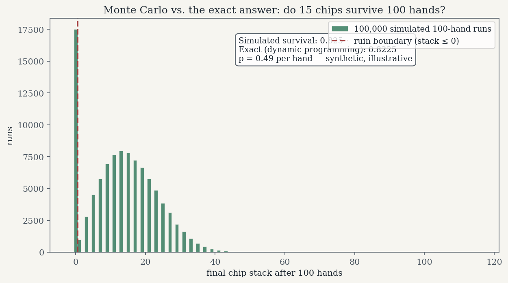
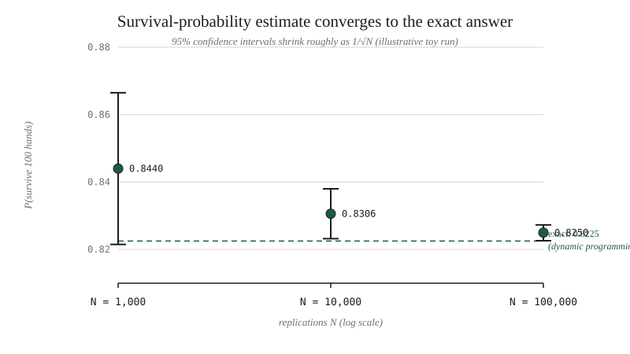

*By [Abdulmalik Ajisegiri](/about)*

Monte Carlo simulation is the art of answering questions with randomness: when you can't derive the answer, you simulate the process many times and let the law of large numbers do the deriving for you. It is the same family of thinking as a discrete-event study I worked through recently — a poker-chip workflow simulated to compare two die configurations, with paired replications and confidence intervals doing the honest work of deciding which die was better. That project is the kind of problem Monte Carlo exists for: stochastic, path-dependent, and resistant to closed-form analysis.

*(A note on the code and numbers in this article: the Python below is my own illustrative reconstruction, written to demonstrate the techniques — not a port of any real codebase, and the toy parameters are invented for demonstration, stated where they appear. Every quoted number is the output of the shown simulation. Where a closed-form "truth" is used, it is used only to validate a variance-reduction method on a test problem, never as a claim about real data.)*

> **Companion repository:** [Poker-Chip-Simulation](https://github.com/Maleek23/Poker-Chip-Simulation)

<div class="widget-card" id="mc-widget">
  <p class="widget-kicker">INTERACTIVE ILLUSTRATION</p>
  <h3 class="widget-title">Watch the simulation converge</h3>
  <p class="widget-sub">The article's chip-stack survival experiment, live in your browser — now with adjustable parameters. Change the win probability, starting stack, or hand count and watch the exact dynamic-programming answer move while the simulation chases it. The lower panel shows where the trials actually ended: the gap between the simulated mean and the untruncated expected value is the ruin drag. Seed 2026, reproducible.</p>
  <div class="widget-controls">
    <label>Win prob. <input type="range" min="0.40" max="0.60" step="0.005" value="0.49" data-p> <strong data-p-label>0.49</strong></label>
    <label>Chips <input type="range" min="5" max="30" step="1" value="15" data-chips> <strong data-chips-label>15</strong></label>
    <label>Hands <input type="range" min="20" max="200" step="10" value="100" data-hands> <strong data-hands-label>100</strong></label>
    <label>Trials
      <select data-trials>
        <option value="1000">1,000</option>
        <option value="10000" selected>10,000</option>
        <option value="100000">100,000</option>
      </select>
    </label>
    <button type="button" data-run>Run simulation</button>
  </div>
  <canvas class="widget-canvas" data-plot aria-label="Live Monte Carlo convergence plot: running survival-probability estimate with 95 percent confidence band converging toward the exact value"></canvas>
  <p class="widget-readout" data-readout></p>
  <p class="widget-subhead">Distribution of final stacks</p>
  <canvas class="widget-canvas" data-hist aria-label="Histogram of final chip stacks across trials, with simulated mean and untruncated expected value lines"></canvas>
  <p class="widget-readout" data-hist-readout></p>
  <p class="widget-note">Illustrative toy parameters from the article. The band is ±1.96·SE around the running estimate — watch it narrow as trials accumulate.</p>
</div>
<script src="/js/mc-widget.js" defer></script>

## When Monte Carlo beats closed-form

Closed-form math wins whenever it exists and its assumptions hold. The expected value of a normal, the Black–Scholes price — when the formula is exact, simulating is just a slower way to be wrong. Monte Carlo earns its keep in three situations:

1. **Path dependence.** The outcome depends on the *sequence* of events, not just the endpoint. A chip stack that hits zero on hand 40 is ruined even if it would have recovered by hand 100; a knock-out option dies on the path, not the terminal price. Closed forms handle endpoints; simulation handles histories.
2. **Non-Gaussian payoffs.** Caps, floors, thresholds, and ruin conditions break the tidy distributions that formulas assume. Simulation doesn't care what shape your payoff is — it just runs the process and records what happened.
3. **Complex state.** Interacting queues, starving downstream stages, feedback loops. The poker-chip workflow is the archetype: four participants passing chips with partial batches when starved, and no closed form for "how many rolls does the last participant need" as a function of the die. You simulate it.

There is a fourth, quieter case: a closed form exists but you don't trust its assumptions. Gaussian tails, constant volatility, independent draws — when the real process violates the fine print, Monte Carlo lets you plug in the ugly distribution and see what actually happens.

## The law of large numbers and the 1/√N tax

The engine is the law of large numbers: the sample mean of N independent replications converges to the true expected value. The price tag is the central limit theorem: the standard error of that mean shrinks as σ/√N. Error falls with the *square root* of effort, which means halving your error costs **four times** the samples. Precision is a budget decision, and the exchange rate is brutal.

Watch it happen on a deliberately skewed payoff — a capped payout, the kind of non-Gaussian quantity from the previous section:

```python
import numpy as np

def estimate(N, seed):
    r = np.random.default_rng(seed)
    payoff = np.minimum(r.normal(0, 1, N), 2.0)   # capped payoff, illustrative
    return payoff.mean(), payoff.std(ddof=1) / np.sqrt(N)

for N in (100, 400, 1600, 6400):
    mu, se = estimate(N, 99)
    print(f"N={N:5d}: estimate {mu:+.4f}  SE {se:.4f}  95% CI half-width {1.96*se:.4f}")
```

Output (illustrative toy run):

```
N=  100: estimate +0.1074  SE 0.0867  95% CI half-width 0.1698
N=  400: estimate -0.0260  SE 0.0510  95% CI half-width 0.1000
N= 1600: estimate -0.0012  SE 0.0247  95% CI half-width 0.0484
N= 6400: estimate +0.0048  SE 0.0122  95% CI half-width 0.0239
```

Each quadrupling of N roughly halves the interval: 0.170 → 0.100 → 0.048 → 0.024. (The half-widths don't halve *exactly* because the estimated σ itself wobbles between runs — another honest detail of simulation.) The practical lesson, and the one that sizes every simulation study: pick N from the interval width your decision needs, not from habit. If the decision changes only when the answer moves by 0.05, a half-width of 0.17 is theater. This is the same 1/√n logic that sizes replication counts in designed experiments — enough replications that the interval answers the question you actually asked.

## Variance reduction: work smarter before running longer

Before buying precision with 4× samples, there are techniques that reduce σ itself. Two of them cover most cases.

**Antithetic variates.** For each random draw X, also evaluate the mirrored draw −X and average the pair. If the output is monotone in the input, f(X) and f(−X) are negatively correlated, and the pair's average has lower variance than two independent draws — the noise partially cancels. Here it is estimating θ = E[exp(X)] for X ~ N(0,1), where the closed form e^{1/2} ≈ 1.6487 is used *only* to check the method on this test problem:

```python
import numpy as np

TRUE = np.exp(0.5)
N = 20000

r = np.random.default_rng(5)
x = r.normal(0, 1, N)
plain = np.exp(x)

z = r.normal(0, 1, N // 2)
anti = 0.5 * (np.exp(z) + np.exp(-z))   # antithetic pairs

for name, s in (("plain     ", plain), ("antithetic", anti)):
    mu, se = s.mean(), s.std(ddof=1) / np.sqrt(len(s))
    print(f"{name}: estimate {mu:.4f}  SE {se:.5f}  95% CI [{mu-1.96*se:.4f}, {mu+1.96*se:.4f}]")
print(f"truth: {TRUE:.4f}   (used only to check the method, never available in practice)")
```

Output (illustrative toy run):

```
plain     : estimate 1.6818  SE 0.01539  95% CI [1.6516, 1.7120]
antithetic: estimate 1.6279  SE 0.01205  95% CI [1.6043, 1.6516]
truth: 1.6487   (used only to check the method, never available in practice)
```

Same number of underlying draws, standard error down from 0.01539 to 0.01205 — roughly a 40% savings in the samples you'd need for the same precision (variance ratio squared). Antithetic pairs shine exactly when the response is monotone in the randomness; for non-monotone responses they can do nothing or even hurt, so the technique is a scalpel, not a default.

**Common random numbers.** When *comparing* two policies, run both on the same random stream. Shared luck then cancels out of the difference: if replication 7 draws an unlucky sequence, both policies suffer it, and the paired difference isolates the policy effect. This is the same idea as the paired t-test design in the poker-chip study — pairing isn't just a statistical test choice, it's a variance-reduction technique you build into the simulation. Here, two bet-sizing "policies" (bet 1 vs bet 2 chips per hand, illustrative) are compared on shared vs. independent streams:

```python
import numpy as np

p, H = 0.55, 100     # per-hand win probability, hands per game (illustrative)
N = 5000

def final_stacks(bet, uniforms):
    wins = (uniforms < p).astype(float)
    return 100.0 + bet * np.cumsum(2 * wins - 1, axis=1)[:, -1]

rng = np.random.default_rng(3)
u_shared = rng.random((N, H))                       # one stream, both policies (CRN)
rng2 = np.random.default_rng(4)
u_a = rng2.random((N, H)); u_b = rng2.random((N, H))  # independent streams

d_crn = final_stacks(1, u_shared) - final_stacks(2, u_shared)
d_ind = final_stacks(1, u_a) - final_stacks(2, u_b)

for name, d in (("independent streams", d_ind), ("common random numbers", d_crn)):
    se = d.std(ddof=1) / np.sqrt(N)
    print(f"{name:>21}: mean diff {d.mean():+.2f}, SE {se:.3f}, "
          f"95% CI [{d.mean()-1.96*se:+.2f}, {d.mean()+1.96*se:+.2f}]")
```

Output (illustrative toy run):

```
  independent streams: mean diff -10.06, SE 0.314, 95% CI [-10.68, -9.45]
common random numbers: mean diff -9.79, SE 0.143, 95% CI [-10.07, -9.51]
```

The standard error of the difference more than halves — equivalent to running over four times as many replications, for free. The implementation detail that matters: synchronize via a shared uniform stream mapped through each policy's own inverse CDF, not merely "the same seed," or consumption order can drift between policies and quietly unpair your comparison.

## How to report results honestly

A Monte Carlo result reported as a bare number is a rumor. The honest report has four parts:

1. **Mean ± confidence interval.** The interval *is* the result; the point estimate without it is decoration. Remember the interval's own standard error is estimated from the same run — with small N it's wobbly, which the 1/√N table above shows plainly.
2. **The replication count.** N = 1,000 and N = 100,000 are different claims. State it.
3. **Seed discipline.** Record the RNG seeds so the run reproduces exactly. A result nobody can reproduce is a result nobody can check — and in simulation, unlike in field experiments, exact reproduction costs nothing, so there's no excuse.
4. **What you didn't compute.** If a p-value cell is empty, leave it empty and say so. If the interval is too wide to settle the decision, say how many more replications would settle it, and resist the urge to keep running until the answer looks nice. An empty cell is information; filling it from imagination is fabrication.

## A worked example: does the chip stack survive 100 hands?

A concrete decision-flavored question in the same family as the poker-chip workflow: starting from a stack of 15 chips, betting 1 chip per hand, winning +1 with probability 0.49 per hand (all parameters illustrative), what is the probability the stack survives 100 hands without hitting zero?

There is no tidy closed form for finite-horizon gambler's ruin — but there is an exact answer via dynamic programming. Let V[t][s] be the probability of surviving the remaining t hands from stack s; then V[t][s] = p·V[t−1][s+1] + (1−p)·V[t−1][s−1], with V[0][s>0] = 1 and V[·][0] = 0. Fill the table backward from the horizon. Then run Monte Carlo at increasing N and watch it converge:

```python
import numpy as np

S0, BET, P, H = 15, 1, 0.49, 100   # all illustrative
SMAX = S0 + H                       # largest stack reachable within the horizon

# Exact answer via dynamic programming.
V = np.zeros((H + 1, SMAX + 1))
V[0, 1:] = 1.0
V[:, 0] = 0.0
for t in range(1, H + 1):
    up = np.minimum(np.arange(SMAX + 1) + 1, SMAX)
    dn = np.maximum(np.arange(SMAX + 1) - 1, 0)
    V[t] = P * V[t - 1][up] + (1 - P) * V[t - 1][dn]
    V[t][0] = 0.0
exact = V[H][S0]
print(f"exact (dynamic programming): {exact:.4f}")

def mc(N, seed):
    r = np.random.default_rng(seed)
    stack = np.full(N, S0)
    alive = np.ones(N, dtype=bool)
    for _ in range(H):
        win = r.random(N) < P
        stack[alive] += np.where(win[alive], BET, -BET)
        alive &= stack > 0
    p_hat = alive.mean()
    se = np.sqrt(p_hat * (1 - p_hat) / N)
    return p_hat, se

for N in (1000, 10_000, 100_000):
    p_hat, se = mc(N, 2026)
    print(f"MC N={N:7d}: estimate {p_hat:.4f}  SE {se:.4f}  "
          f"95% CI [{p_hat-1.96*se:.4f}, {p_hat+1.96*se:.4f}]")
```

Output (illustrative toy run):

```
exact (dynamic programming): 0.8225
MC N=   1000: estimate 0.8440  SE 0.0115  95% CI [0.8215, 0.8665]
MC N= 10000: estimate 0.8306  SE 0.0038  95% CI [0.8232, 0.8380]
MC N=100000: estimate 0.8250  SE 0.0012  95% CI [0.8226, 0.8273]
```



*Distribution of terminal chip stacks from 100,000 simulated runs of the article's example (15 chips, p = 0.49, 100 hands). The spike at zero is ruin; the simulated survival rate (0.825) lands on the dynamic-programming exact value (0.8225). Synthetic data, for illustration only.*



*Figure — MC estimates of survival probability at N = 1,000 / 10,000 / 100,000, each with its 95% CI, converging to the dynamic-programming exact value 0.8225. Illustrative toy run.*

The simulation converges onto the exact value, and each interval contains it. Now read it as a decision-maker: at N = 1,000 the 95% interval spans 4.5 percentage points — plenty if your decision threshold is far from the estimate, useless if you're deciding at a knife's edge near 0.82. Monte Carlo doesn't tell you what to decide; it tells you how much you know, which is what a decision actually needs.

One honest footnote on this example: the dynamic program *is* the closed form here, and it ran in milliseconds — for this toy, simulation was the slower route. The example earns its place anyway, because it shows the convergence behavior against a known truth. In the problems where Monte Carlo is actually needed — the path-dependent, non-Gaussian, complex-state ones from the first section — there is no DP table to check against, and the interval is all you have. That's when the reporting discipline from the previous section stops being etiquette and starts being the entire basis of trust.

## Monte Carlo doesn't remove uncertainty — it prices it

That is the decision framing to take away. A point estimate is a bet; a confidence interval is a price. Monte Carlo turns "I don't know what happens" into "I know the distribution of what happens" — expected values under the real payoff shape, worst-case quantiles for the scenarios that keep you up at night, and an honest statement of how much simulation stands behind each number. The future stays uncertain. The difference is that now the uncertainty is legible enough to act on: set thresholds against the interval, not the point; budget the 4× cost of precision before you need it; reduce variance with structure (pairing, antithetics) before you buy it with samples. The simulation doesn't make the decision for you. It makes the decision possible.

## Related reading

- [Designing a Discrete-Event Simulation Experiment: Replications, Paired Comparisons, and Honest Statistics](/research/discrete-event-simulation-experiment-design/)
- [Survivorship Bias and Lookahead: Two Backtest Killers, with Code](/research/survivorship-bias-lookahead-backtest-killers/)
