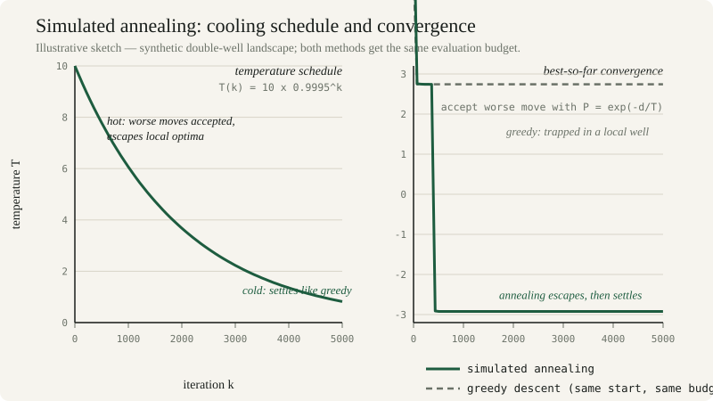

*By [Abdulmalik Ajisegiri](/about)*

*All code below is self-contained Python over synthetic toy problems — a double-well landscape and a synthetic parts catalog — written to be read and run, not copied from any production system. Every number shown is illustrative, not measured.*

## The decision problem, formalized

Engineering decisions are optimization problems wearing work clothes. Choosing a configuration, allocating resources, sizing components, scheduling operations — each is a search for the best element of some feasible set according to some measure of goodness. Formalizing that search — decision variables, objective function, constraints — is often half the work, because it forces the vague ("make it better") into the precise ("minimize cost subject to these reliability constraints").

The classical toolkit — linear programming, convex optimization, gradient descent and its relatives — handles the well-behaved cases beautifully. But real engineering trade spaces are rarely well-behaved. They are discrete (you can't buy 2.7 pumps), non-convex (the objective has many local optima), multi-objective (cost vs. reliability vs. schedule, with no single answer), noisy (objectives evaluated by simulation), and constrained in ways that are hard to write down. When gradient methods stall on such problems, metaheuristics earn their keep.

## Why classical methods stall

Gradient-based and convex methods make assumptions that messy problems violate:

- **Differentiability.** If the objective is a simulation with stochastic outputs or a lookup table of vendor catalogs, there is no gradient to follow.
- **Convexity.** Non-convex landscapes trap local methods in the nearest valley. Random restarts help, but they are a patch, not a strategy.
- **Continuity.** Discrete and combinatorial decisions — which components, which order, which assignments — live in spaces gradients cannot traverse.
- **Single objective.** Classical methods optimize one thing. Engineering decisions trade off several, and the answer is a Pareto frontier — the set of solutions where no objective improves without another worsening — not a point.

None of this means classical methods are obsolete. It means the first question of any optimization effort is *what kind of problem is this?* If it is convex, continuous, and single-objective, use the classical tools; they give guarantees metaheuristics cannot. Metaheuristics are for the rest.

<div class="widget-card" id="gd-widget">
  <p class="widget-kicker">INTERACTIVE ILLUSTRATION</p>
  <h3 class="widget-title">Watch gradient descent get trapped</h3>
  <p class="widget-sub">Gradient descent on a double-well landscape, live in your browser — f(x) = x⁴ − 3x² + x, the same shape as the article's toy problem. Start in the right-hand valley and gradient descent converges happily… into the <em>local</em> minimum, never finding the deeper one. Crank the learning rate and watch it oscillate or blow up; flip to simulated annealing and watch the Boltzmann rule climb out of the trap. Click the plot to choose a starting point.</p>
  <div class="widget-controls">
    <label>Method
      <select data-method>
        <option value="gd" selected>Gradient descent</option>
        <option value="sa">Simulated annealing</option>
      </select>
    </label>
    <label>Learning rate <input type="range" min="-3" max="0" step="0.05" value="-1.3" data-lr> <strong data-lr-label>0.05</strong></label>
    <label>Start x <input type="range" min="-2.5" max="2.5" step="0.1" value="1.8" data-start> <strong data-start-label>1.8</strong></label>
    <button type="button" data-run>Run</button>
  </div>
  <canvas class="widget-canvas" aria-label="Gradient descent playground: loss landscape with the optimizer's path drawn live"></canvas>
  <p class="widget-readout" data-readout></p>
  <p class="widget-note">Illustrative toy landscape. The minima markers are located numerically at load (grid search + Newton refinement) — try starting left of x = −0.5 versus right of it and compare where each method lands.</p>
</div>
<script src="/js/gd-widget.js" defer></script>

## Simulated annealing, concretely

Simulated annealing walks a single solution through the space, accepting worse moves with probability `exp(-Δ/T)` — the Boltzmann rule — where the "temperature" T decreases over time. Early heat lets the search climb out of local optima; cooling settles it into a good basin. The method shines on problems with a natural neighborhood structure (swap, insert, perturb) and is the simplest of the three workhorses to implement correctly.

Here is a complete SA solver over an illustrative toy landscape — a double well with sinusoidal ripples, so gradient descent gets trapped — with a box constraint handled as a quadratic penalty:

```python
# --- Illustrative toy problem: synthetic double-well landscape ---
import math
import random

def cost(x):                       # synthetic, non-convex; NOT a real cost model
    return (x ** 2 - 4) ** 2 + 3 * math.sin(2.5 * x)

def penalized(x):                  # box constraint |x| <= 3 via quadratic penalty
    return cost(x) + 1000 * max(0, abs(x) - 3) ** 2

def anneal(start, steps=5000, t0=10.0, cooling=0.9995, seed=0):
    rng = random.Random(seed)
    x, fx = start, penalized(start)
    best, best_fx, T = x, fx, t0
    trace = []                     # best-so-far per iteration (convergence curve)
    for _ in range(steps):
        cand = x + rng.gauss(0, 0.6)
        f_cand = penalized(cand)
        delta = f_cand - fx
        if delta < 0 or rng.random() < math.exp(-delta / T):
            x, fx = cand, f_cand
            best, best_fx = (x, fx) if fx < best_fx else (best, best_fx)
        T *= cooling
        trace.append(best_fx)
    return best, best_fx, trace

x_star, f_star, hist = anneal(start=-1.0, seed=3)
print(f"best x = {x_star:.3f}, cost = {f_star:.3f}   (illustrative)")
```

Run it and compare against plain greedy descent from the same start: greedy slides into the nearest well and stops; annealing's early heat lets it hop the barrier. The figure below sketches exactly this behavior — the cooling schedule that makes escape-then-settle possible, and the convergence gap between annealing and a greedy local search given the same evaluation budget:



*Figure — geometric cooling drives escape-then-settle behavior; under the same evaluation budget, annealing escapes the trap that stops greedy descent (illustrative sketch, not measured data).*

Three implementation notes that separate working SA from broken SA:

- **Scale the temperature to the cost scale.** The acceptance rule `exp(-Δ/T)` only makes sense if T is on the order of typical Δ values. Normalize or calibrate: start T so the initial acceptance rate of worsening moves is around 50–80%.
- **Track best-so-far, not the final state.** The walk is stochastic; the final position can be worse than an earlier one. Keep the incumbent.
- **The cooling schedule is the method.** Geometric cooling (`T *= alpha`) is the default; too fast and you get expensive greedy search, too slow and you burn budget wandering. `alpha` in [0.99, 0.9999] per-step is the usual working range.

## Genetic algorithms, concretely

Where SA walks one solution, a GA evolves a population through selection, crossover, and mutation. GAs are the natural choice for combinatorial problems — scheduling, layout, configuration, subset selection — because crossover combines partial solutions in ways that respect problem structure. Their strength is global exploration; their weakness is slow fine-grained convergence.

Toy example: pick exactly 8 parts from a synthetic catalog of 20 to maximize total reliability without blowing a budget — a knapsack-flavored configuration problem:

```python
# --- Illustrative toy problem: synthetic parts catalog ---
import random

rng = random.Random(7)
N, K, BUDGET = 20, 8, 60
price = [rng.randint(2, 15) for _ in range(N)]
reliability = [round(rng.uniform(0.5, 0.99), 3) for _ in range(N)]

def fitness(pick):                       # pick: list of N 0/1 genes
    if sum(pick) != K:
        return -1e9                      # hard constraint via death penalty
    over = max(0, sum(p * g for p, g in zip(price, pick)) - BUDGET)
    return sum(r * g for r, g in zip(reliability, pick)) - 5.0 * over

def evolve(pop_size=120, generations=200, seed=1):
    rng = random.Random(seed)
    pop = [[rng.randint(0, 1) for _ in range(N)] for _ in range(pop_size)]

    def tournament():
        a, b = rng.sample(pop, 2)
        return a if fitness(a) >= fitness(b) else b

    for _ in range(generations):
        nxt = []
        while len(nxt) < pop_size:
            p1, p2 = tournament(), tournament()
            cut = rng.randrange(N)
            child = p1[:cut] + p2[cut:]             # single-point crossover
            if rng.random() < 0.05:                 # mutation
                i = rng.randrange(N)
                child[i] ^= 1
            nxt.append(child)
        pop = nxt
    return max(pop, key=fitness)

winner = evolve()
print(f"fitness = {fitness(winner):.3f}   (illustrative, synthetic catalog)")
```

The operator choices encode domain knowledge, and that is both the power and the risk: a crossover that preserves feasible structure (e.g. swapping whole time-windows in a schedule) explores meaningfully; a generic crossover on a problem whose feasibility is fragile just manufactures broken children that the penalty function then rejects. If crossover isn't doing structural work for your problem, a GA degrades into parallel random search with extra steps — the ablation test in the tuning section will catch this.

## Handling constraints without lying to yourself

Constraints arrive in three flavors, and each wants a different treatment:

- **Penalty methods.** Add a penalty term to the objective, as in the SA example. Easy and general, but the penalty weight is now a parameter with teeth: too small and the "optimum" is infeasible; too large and the landscape becomes a cliff that blocks the search from *crossing* infeasible regions to reach good feasible ones — even when the shortest path between two feasible solutions passes through infeasibility. Start moderate, and consider scaling the penalty up over the run (like temperature in reverse).
- **Repair operators.** Project infeasible solutions back into feasibility (swap parts until the budget holds, clip to bounds). Repair keeps every evaluation honest — the objective is only ever evaluated on feasible points — but repair must be cheap, and biased repair can silently steer the search.
- **Feasibility-preserving operators.** Design the representation so infeasible solutions can't be expressed (permutation encodings for orderings, exact-K subsets via swap-only mutation). This is the cleanest option when the structure allows it; it moves the constraint from the objective into the representation where it belongs.

Whatever you choose, **report feasibility separately from objective value.** "Cost 4.2" next to "3 constraints violated by this much" is honest; a penalized score alone lets an infeasible optimum masquerade as a solution.

## Particle swarm and the rest of the tour

**Particle swarm optimization (PSO)** flies a population of particles through continuous space, each pulled toward its own best position and the swarm's best. It is a strong default for continuous, non-convex, moderately-dimensioned problems — fewer moving parts than a GA, better global behavior than pure gradient descent.

Beyond the big three: **tabu search** for combinatorial problems where memory of visited solutions prevents cycling, **differential evolution** for continuous black-box optimization, and **Bayesian optimization** when each objective evaluation is expensive (a simulation taking hours) and the budget is dozens of evaluations, not thousands.

Multi-objective problems deserve **NSGA-II** or similar Pareto-based methods, which return the frontier rather than forcing the objectives into an arbitrary weighted sum. The weighted-sum hack collapses the trade-off before the decision-maker ever sees it — exactly backwards from how engineering decisions should be made. A useful middle ground when you must ship a single number: optimize under several weightings and plot the resulting points — a poor man's frontier that at least shows the trade-off's shape before anyone commits to it.

## Comparing methods honestly

Metaheuristics are stochastic, and comparing them by "best run found" is evaluation theater. The honest comparison harness has three rules:

```python
# --- comparison protocol (pseudocode; plug in anneal/evolve above) ---
import numpy as np

BUDGET = 600_000          # same objective-function evaluations for every method
SEEDS = range(20)         # same seeds for every method

def race(method):          # method(seed, budget) -> best feasible objective
    return [method(seed=s, budget=BUDGET) for s in SEEDS]

for name, vals in [("simulated annealing", race(anneal)),
                   ("genetic algorithm", race(evolve)),
                   ("random restart greedy", race(restart_greedy))]:
    vals = np.array(vals)
    print(f"{name:22s} median={np.median(vals):.3f}  "
          f"p10={np.percentile(vals,10):.3f}  p90={np.percentile(vals,90):.3f}")
```

1. **Equal evaluation budget, not equal iterations.** One GA generation can cost as much as a hundred SA steps; wall-clock or evaluation-count fairness, never iteration-count fairness.
2. **Distributions, not bests.** Report median and spread across seeds. A method whose best beats everything but whose median loses is a lottery ticket.
3. **Ablate before you believe.** Random-restart greedy is the null hypothesis. If the fancy operator doesn't beat it under the same budget, the complexity is unjustified — the burden of proof is on the elaborate configuration.

Also separate the *tuning* problem from the *decision* problem: tune the optimizer on a representative set of problem instances, freeze the parameters, then evaluate on held-out instances. Tuning the cooling schedule on the same instance you report results on is the optimization analog of backtest overfitting.

## Avoiding over-tuning to the problem instance

The deepest trap in applied optimization is solving *the instance* rather than *the problem*. An algorithm tuned, seeded, and operator-selected until it produces a beautiful answer on this year's configuration has been overfit to a single draw from the problem distribution — and engineering problems are distributions: next year's loads, costs, and constraints will differ.

Countermeasures mirror those in model validation, because the failure is the same failure:

- **Validate on perturbed instances.** Change the inputs within their realistic uncertainty bands and check that the chosen solution stays good — robust solutions beat brittle optimal ones.
- **Prefer robustness over optimality.** A solution within 2% of optimal across a wide range of scenarios dominates a solution that is exactly optimal for one scenario and terrible for the next.
- **Keep the human in the loop.** The Pareto frontier is a decision aid, not a decision. The optimizer's job is to shrink the trade space to its efficient frontier; the engineer's job is to choose on it, informed by the criteria the objective function couldn't capture.

Optimization is a tool for *making decisions under uncertainty*, and the uncertainty deserves as much modeling effort as the search. A metaheuristic that finds the global optimum of the wrong problem is precise, expensive, and useless.

## Related reading

- [Monte Carlo for Decisions Under Uncertainty](/research/monte-carlo-decisions-under-uncertainty/)
- [Validating Models Like a Skeptic: The Outcomes-Analysis Playbook](/research/validating-models-like-a-skeptic/)
- [Engineering](/engineering)
- [Quantitative Work](/quant)
