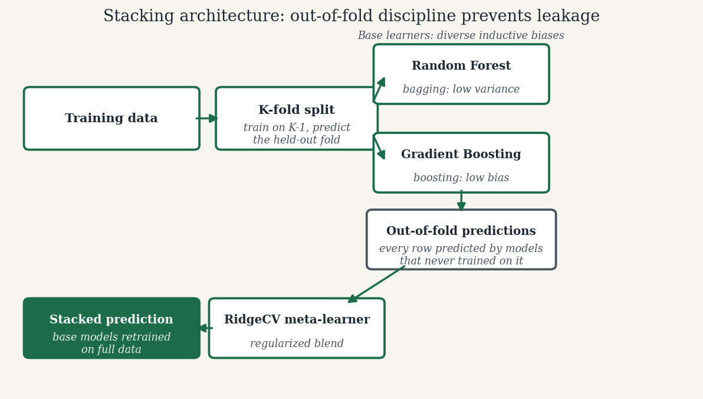
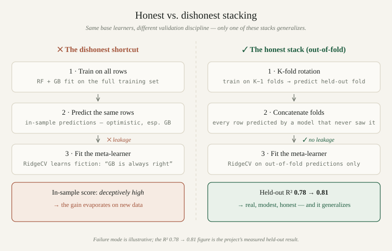

*By [Abdulmalik Ajisegiri](/about)*

*This article is grounded in a public project of mine, [cardiac-surgery-predictive-model](https://github.com/Maleek23/cardiac-surgery-predictive-model): an ML-based clinical support tool that predicts postoperative risk in cardiac surgery — operative mortality, renal failure, prolonged ventilation, stroke — from preoperative patient data, designed in alignment with Society of Thoracic Surgeons (STS) database standards. The code below is an illustrative reconstruction of the pipeline pattern, not a verbatim dump of the repo.*

A stacked ensemble improved that project's risk model from R² 0.78 (a tuned GradientBoostingRegressor) to R² 0.81 (a Random Forest + Gradient Boosting stack). That's a real gain, not a rounding artifact — but it's also exactly the kind of gain that should make you suspicious. Ensembles are the most reliable free lunch in ML, and also one of the easiest places to fool yourself with leakage.

This article is about the discipline that separates the two: why stacking helps, when it can't, the out-of-fold prediction machinery that keeps the meta-learner honest, and why R² is a dangerously thin basis for trusting a model that touches clinical decisions.

## Why stacking helps — and when it can't

Stacking works for one reason: **error diversity**. A single model has a fixed set of blind spots. Two models whose errors are uncorrelated can cancel each other's mistakes when combined — the variance of the average is less than the average of the variances, provided the correlation between the errors isn't 1.

Random Forest and Gradient Boosting are a textbook-diverse pairing for this:

- **Random Forest** is a bagging method. Deep, decorrelated trees averaged together give low variance, high stability, and a tendency to underfit sharp nonlinear boundaries.
- **Gradient Boosting** is a boosting method. Shallow trees fit sequentially on residuals give low bias and a tendency to chase noise — overfitting in the opposite direction.

One smooths, one sharpens. Their inductive biases differ enough that their residuals on the same rows are genuinely different, which is the precondition for stacking to buy anything. A meta-learner (a small regularized regression on the base models' predictions) can then learn something like "trust RF in this region of feature space, trust GB in that one."

And when stacking *can't* help: when the base learners are strongly correlated. Stack two Gradient Boosting models with slightly different learning rates and you've built a slower, more expensive single model — the meta-learner has nothing diverse to combine, and you're paying for complexity with zero generalization benefit. Before stacking, I check the cross-validated correlation between base-learner predictions. If it's above ~0.95 on held-out data, I don't bother stacking; I pick the better one and move on.

## The pipeline pattern

Before any modeling, the project pipeline does the unglamorous work that stacking gains depend on: fill missing values (drop rows still containing NaNs after imputation decisions), normalize numerics with `MinMaxScaler`, one-hot encode the categoricals (gender, insurer, procedure type), and select features using both correlation analysis (a correlation heatmap is in the repo) and model-based importance. An optional Yeo-Johnson power transformation improves residual behavior for the regression targets.

Two decisions here matter for generalization. First, `MinMaxScaler` is fit on training folds only and applied to validation — scaler statistics leaking across the split would quietly inflate every number downstream. Second, feature selection by correlation against the *target* must also happen inside the training data of each evaluation split, or the "selected" features carry target information into validation. The safest way to enforce both is to build the whole thing — scaling, selection, base models, meta-learner — inside a single scikit-learn `Pipeline`, so cross-validation slices every step together.

## Out-of-fold predictions: the discipline that prevents leakage

Here's the failure mode that kills naive stacks. You train RF and GB on the training set, then generate their predictions on that *same* training set, and fit the meta-learner on those predictions. The base models have already seen those rows — their training-set predictions are optimistic, especially for Gradient Boosting, which can nearly memorize. The meta-learner then learns "GB is always right" from fiction, and the stack collapses on new data while looking perfect in-sample.

The fix is **out-of-fold (OOF) meta-features**: the predictions used to train the meta-learner must come from base models that never saw those rows. The standard construction:

1. Split the training data into K folds.
2. For each fold, train each base learner on the other K−1 folds and predict the held-out fold.
3. Concatenate: every training row now has one prediction per base learner, produced by a model that never trained on it.
4. Fit the meta-learner on those OOF predictions.
5. For inference, retrain each base learner on the *full* training set.



*The stacking architecture. The only thing the meta-learner ever sees are out-of-fold predictions — every row predicted by base models that never trained on it.*

scikit-learn's `StackingRegressor` does exactly this when you pass `cv`:

```python
import numpy as np
from sklearn.ensemble import RandomForestRegressor, GradientBoostingRegressor, StackingRegressor
from sklearn.linear_model import RidgeCV
from sklearn.model_selection import cross_val_predict, KFold
from sklearn.pipeline import Pipeline
from sklearn.preprocessing import MinMaxScaler
from sklearn.compose import ColumnTransformer
from sklearn.preprocessing import OneHotEncoder

# --- Preprocessing: fit inside CV, never outside ---
numeric_features = [...]      # e.g. age, bmi, ejection_fraction, creatinine
categorical_features = ["gender", "insurer", "procedure_type"]

preprocess = ColumnTransformer([
    ("num", MinMaxScaler(), numeric_features),
    ("cat", OneHotEncoder(handle_unknown="ignore"), categorical_features),
])

# --- Base learners: diverse inductive biases ---
rf = RandomForestRegressor(
    n_estimators=500, max_depth=None, min_samples_leaf=5,
    n_jobs=-1, random_state=42,
)
gb = GradientBoostingRegressor(
    n_estimators=300, learning_rate=0.05, max_depth=3,
    subsample=0.8, random_state=42,
)

# --- The stack: OOF meta-features via cv, regularized meta-learner ---
stack = StackingRegressor(
    estimators=[("rf", rf), ("gb", gb)],
    final_estimator=RidgeCV(alphas=np.logspace(-3, 3, 13)),
    cv=KFold(n_splits=5, shuffle=True, random_state=42),
    passthrough=False,   # meta-learner sees only base predictions; set True to also pass raw features
    n_jobs=-1,
)

pipe = Pipeline([("preprocess", preprocess), ("stack", stack)])
```

`cv=5` is doing the critical work: inside `fit`, `StackingRegressor` runs `cross_val_predict` under the hood, so `final_estimator` (here `RidgeCV`, which also tunes its own regularization — stacking the meta-learner needs shrinkage, not another overfitter) trains on OOF predictions only. The base estimators are then refit on the full training data for inference. If you ever write a manual stacking loop, the equivalent explicit check needs a processed feature matrix and target — a synthetic stand-in to run it as-is:

```python
# --- Synthetic setup: processed features + target (illustrative stand-in) ---
from sklearn.datasets import make_regression

X_train_processed, y_train = make_regression(
    n_samples=800, n_features=12, noise=12.0, random_state=42
)
```

```python
oof = {
    name: cross_val_predict(est, X_train_processed, y_train,
                            cv=KFold(5, shuffle=True, random_state=42), n_jobs=-1)
    for name, est in [("rf", rf), ("gb", gb)]
}
print("OOF prediction correlation (want this well below ~0.95):",
      np.corrcoef(oof["rf"], oof["gb"])[0, 1])
```

That correlation number is the cheapest go/no-go test in ensemble work. Diverse base learners, honest OOF meta-features, regularized meta-learner — that triple is the entire secret. Everything else is tuning.


*Figure — The naive stack looks great in-sample and fails on new data; the out-of-fold stack's R² 0.78 → 0.81 was measured on data neither tuning nor stacking ever saw.*

<div class="widget-card" id="overfit-widget">
  <p class="widget-kicker">INTERACTIVE ILLUSTRATION</p>
  <h3 class="widget-title">Feel the optimism gap open up</h3>
  <p class="widget-sub">The article's honesty lesson in miniature: a noisy regression fit with polynomials of degree 1–12, computed live by exact least squares. Drag the degree slider — training error falls monotonically while validation error U-turns. The gap between them is the <em>optimism gap</em>: everything a model claims in-sample that new data refuses to confirm. This is the failure mode out-of-fold validation exists to catch.</p>
  <div class="widget-controls">
    <label>Polynomial degree <input type="range" min="1" max="12" step="1" value="3" data-degree> <strong data-degree-label>3</strong></label>
  </div>
  <canvas class="widget-canvas" data-fit aria-label="Scatter plot of training and validation data with the fitted polynomial curve"></canvas>
  <canvas class="widget-canvas widget-canvas-short" data-err aria-label="Training versus validation RMSE as polynomial degree increases"></canvas>
  <p class="widget-readout" data-readout></p>
  <p class="widget-note">Synthetic data, seed 7 — 40 training and 40 validation points around a sine curve. Dots are training data, crosses are held-out validation the fit never saw.</p>
</div>
<script src="/js/overfit-widget.js" defer></script>

## A sane RandomizedSearchCV strategy

The project tunes with `RandomizedSearchCV` rather than grid search, which is the right call: for a fixed compute budget, random search explores more distinct values of the hyperparameters that actually matter (Bergstra & Bengio's result holds up in practice — grids waste evaluations re-testing unimportant parameters).

The strategy that generalizes, not just the API call:

- **Search wide on what matters, fix what doesn't.** For GB: `learning_rate` (log-uniform 0.01–0.3), `max_depth` (2–6), `subsample` (0.6–1.0), `n_estimators` (100–600). For RF: `max_depth` (None, 10–40), `min_samples_leaf` (1–10), `max_features` (sqrt/log2/0.5). Don't search `n_estimators` for RF finely — more trees almost never hurt, they just cost time.
- **Tune the base learners separately first, then the stack jointly.** Tuning everything end-to-end inside `StackingRegressor` is possible but the search space explodes; a pragmatic sequence is: tune each base learner with CV, lock in good regions, then do a narrow joint pass (mostly the meta-learner's regularization and `passthrough`) around those regions.
- **Optimize the right objective.** `RandomizedSearchCV(scoring="r2")` was the project's choice, but choose the scorer that matches the decision the model supports (more on that below). And always set `refit=True` with the best params refit on the full training set — the search's CV scores are for *selection*, not for reporting final performance.
- **Keep a truly held-out test set that the search never touches.** Model selection by CV score followed by reporting the best CV score is selection bias — you've optimized over the validation folds. The honest final number comes from data that participated in neither tuning nor stacking.

The R² 0.78 → 0.81 improvement in this project was measured with that discipline: tuned base model versus tuned stack, evaluated on held-out data. A 0.03 absolute R² gain from stacking a diverse pair is exactly the magnitude you should expect when it works — modest, real, and worth having.

## Why R² alone is a weak basis for high-stakes decisions

Here's the uncomfortable part. R² measures the fraction of target variance explained — a global, symmetric, squared-error statistic. Clinical risk decisions are none of those things:

- **Calibration matters more than ranking.** R² rewards getting the ordering right. But a decision-maker asking "should this patient get an ICU bed?" needs *calibrated probabilities or risk scores*: a predicted risk of 0.08 should mean roughly an 8% event rate. A model can have excellent R² and be systematically miscalibrated in the tails — exactly where high-stakes decisions live. Check calibration curves and expected calibration error on held-out data, not just R².
- **Decision thresholds need cost analysis, not defaults.** The model's job isn't to output a number; it's to support a thresholded action (flag for review, allocate resources). False negatives (missing a high-risk patient) and false positives (unnecessary interventions, alarm fatigue) have wildly asymmetric costs. The threshold should come from that cost asymmetry — ideally a decision-curve analysis — not from 0.5.
- **Error asymmetry is invisible to R².** Squared error treats over- and under-prediction identically. Underestimating operative mortality risk is far worse than overestimating it. If the loss function doesn't encode that, the model optimizes the wrong thing. Quantile regression, asymmetric loss functions, or at minimum reporting the full residual distribution (the project's Yeo-Johnson transformation was aimed at residual behavior — a good instinct) all beat a single R².
- **Subgroup performance is the real validation.** An aggregate R² of 0.81 can hide terrible performance on the patients who matter most — the highest-risk decile, or subgroups defined by procedure type or age. Slice the metrics. If the model is weakest where the stakes are highest, the headline number is misleading.

This is the applied lesson that connects to formal model-risk practice: validation isn't "did the score go up," it's "do we understand how this model fails, for whom, and what happens when it does." The stacking gain is real, but it buys variance reduction — it doesn't buy trust. Trust comes from calibration checks, threshold analysis grounded in costs, subgroup evaluation, and documentation of limitations. That's the difference between a model that scores well and a model that's safe to use.

## The engineering takeaway

Stacking is worth it when three conditions hold: base learners with genuinely diverse errors (check OOF prediction correlation), a meta-learner trained strictly on out-of-fold predictions (never in-sample fits), and a regularized final estimator so the meta-learner can't memorize noise. Tune with randomized search over the parameters that matter, keep a held-out test set the search never sees, and report the honest number.

Then do the harder part: validate like the model's outputs drive real decisions — because in clinical risk modeling, they might. Calibration, cost-aware thresholds, asymmetric error analysis, and subgroup slices are what turn a 0.81 into something you can stand behind. The ensemble gets you the last few points of accuracy; the validation discipline is what makes them count.

## Related reading

- [Validating Models Like a Skeptic: The Outcomes-Analysis Playbook](/research/validating-models-like-a-skeptic/)
