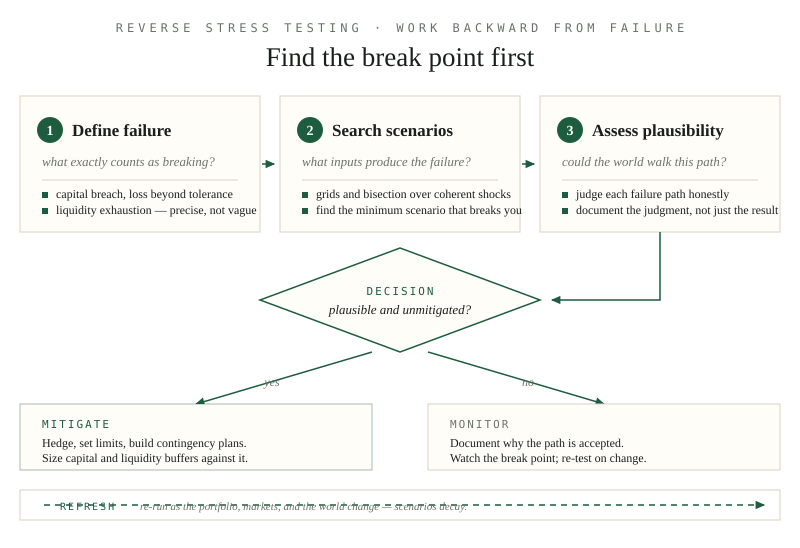

*By [Abdulmalik Ajisegiri](/about)*

*Note: this is educational commentary on stress testing as a model-risk discipline, in general terms only — not a description of any institution's internal practices.*

## Why point estimates aren't enough

A model that produces a single number — an expected loss, a fair value, a risk metric — is telling you the center of a story while hiding the edges. Risk doesn't live in the expectation; it lives in the distribution, and specifically in the tails where the expectation is a poor summary. Stress testing and scenario analysis exist to ask the question point estimates can't: what happens when conditions are bad, in specific, concrete ways?

This is not the same as sensitivity analysis. Sensitivity asks how much the output moves when one input moves a little — a local question. Stress testing asks what happens under a coherent, severe, adverse *state of the world* — a global question. A portfolio can be insensitive to every input in isolation and still collapse when several move together. Correlations that look mild in normal times have a habit of going to one precisely when it hurts most.

## The three scenario families

Stress scenarios come in three broad families, each with different strengths:

1. **Historical scenarios** — replaying actual past stress events: the 2008 financial crisis, the COVID-19 market shock, past rate-hiking cycles. Their virtue is realism: these are shocks that demonstrably happened, with real joint behavior across risk factors, not assumed correlations. Their limitation is obvious: the next crisis will not be a replay of the last one. A stress program built only on history is a program that prepares for the previous war.
2. **Hypothetical scenarios** — constructed narratives: a sudden 300-basis-point rate shock combined with a credit spread blowout, a geopolitical event that disrupts a key supply chain. These let you target the specific vulnerabilities of your portfolio or model rather than hoping history happened to probe them. The danger is that constructed scenarios reflect the constructor's imagination — and imagination is bounded by recent experience.
3. **Reverse stress tests** — starting from failure and working backward. Instead of asking "what does this scenario do to us," reverse stress testing asks "what would have to happen for us to fail?" and then assesses whether that path is plausible. This is the most underused family and often the most revealing, because it bypasses the imagination problem: you don't need to dream up the scenario, only to evaluate the plausibility of the ones that emerge.

A serious stress program uses all three. History grounds you, hypotheticals target you, and reverse tests surprise you.

## Scenario design discipline

Bad stress tests are worse than none, because they produce false confidence. Designing scenarios that actually teach you something requires discipline:

- **Coherence over severity.** A scenario where every risk factor moves against you simultaneously by five standard deviations is severe but incoherent — it describes a world that can't exist. Scenarios must be internally consistent: the narrative has to explain *why* these things happen together. A rate shock driven by an inflation surprise implies specific behavior in credit, equities, and FX; the scenario should reflect the mechanism, not just stack adverse moves.
- **Target the model's assumptions, not just its inputs.** Every model has load-bearing assumptions: that a spread relationship holds, that liquidity exists at quoted prices, that a historical correlation persists. The most valuable scenarios are the ones that violate the assumptions the model depends on most. If your model assumes you can exit a position in a day, the scenario to run is the one where you can't.
- **Calibrate severity honestly.** "Severe but plausible" is the standard phrase, and both words do work. Too mild and the test tells you nothing; too extreme and the results get dismissed as fantasy. One practical approach: anchor hypothetical scenarios to historical precedents and then extend them — the 2008 shock, but 1.5x, or applied to today's portfolio concentrations.
- **Keep the transmission mechanism explicit.** Document how the scenario propagates: which risk factors move, by how much, over what horizon, and through which channels they hit the portfolio. A scenario whose mechanics are opaque can't be challenged, and an unchallengeable stress test is theater.

## Sensitivity grids: mapping the break points

Before committing to full narrative scenarios, a sensitivity grid maps *where* a model breaks — cheaply and systematically. Pick two or three key risk factors, shock them across a grid of coherent severities, and record the model's output at each cell. The exercise below uses a deliberately toy loss function; all numbers are synthetic illustrations of the method, not calibrated to any real portfolio:

```python
# --- Synthetic setup: a toy loss function (illustrative stand-in) ---
import numpy as np

rng = np.random.default_rng(7)

def stressed_loss(unemp_shock, spread_shock, liquidity_haircut=0.0):
    """Toy model: losses compound nonlinearly (illustrative only)."""
    base = 100.0                                   # synthetic baseline units
    credit = 18.0 * unemp_shock ** 2               # credit deteriorates quadratically
    funding = 6.0 * spread_shock * (1 + unemp_shock)  # cross-term: spreads bite harder when credit is weak
    forced_sale = liquidity_haircut * (credit + funding)
    return base + credit + funding + forced_sale
```

```python
# shock grid: unemployment (pp) x credit spreads (100s of bps), coherent pairs
unemp = np.array([0, 2, 4, 6, 8])          # percentage-point rises
spreads = np.array([0, 1.5, 3.0, 4.5, 6])  # spread blowouts, illustrative scale
tolerance = 250.0                          # synthetic loss limit

grid = np.array([[stressed_loss(u, s) for s in spreads] for u in unemp])
breach = grid > tolerance

print("rows: unemployment shock, cols: spread shock — X marks the break point:")
for i, u in enumerate(unemp):
    print(f"  unemp+{u}pp |", " ".join(f"{v:6.0f}{'X' if b else ' '}" for v, b in zip(grid[i], breach[i])))
```

Two things to read off the grid. First, the **break-point contour** — the line where cells flip from safe to breached — tells you how much compound stress the portfolio absorbs before failure.

Second, the **interaction term**: if the breached region grows faster diagonally than along either axis, the model's risk is driven by joint moves, not single factors — which is exactly what one-factor-at-a-time sensitivity misses. The grid is also the cheapest place to discover which factors deserve full narrative scenarios: the ones that reach the contour first.

Document the contour itself, not just the scenario outcomes: it is the artifact a challenger or an independent reviewer will probe first.

## Reverse stress testing in practice

Reverse stress testing deserves elaboration because it's conceptually different. The procedure: define the failure condition precisely (capital breach, liquidity exhaustion, a loss beyond tolerance), then search — analytically or computationally — for the scenarios that produce it. Then, crucially, assess plausibility: is this failure path something the real world could walk?

What makes this powerful is that it finds *combinations* nobody would have constructed forward. The failure mode of a complex portfolio is often a specific cocktail of moderate moves — nothing dramatic in isolation — that interact badly. Forward scenario design rarely finds those because each individual move looks too boring to include. Reverse testing finds them because it starts from the outcome and asks what inputs produce it.

A simple computational version: bisect on a coherent shock vector's severity until the loss just breaches tolerance. This finds the *minimum* scenario that breaks you — the closest failure, and usually the most instructive one:

```python
# --- reverse search: smallest coherent shock that breaches tolerance (illustrative) ---
def coherent_shock(severity):
    """Scale a coherent shock narrative: unemployment, spreads, liquidity move together."""
    return stressed_loss(unemp_shock=8.0 * severity,
                         spread_shock=6.0 * severity,
                         liquidity_haircut=0.5 * severity)

lo, hi = 0.0, 1.0
while hi - lo > 1e-4:
    mid = (lo + hi) / 2
    if coherent_shock(mid) > tolerance:
        hi = mid        # still breaks: tighten from above
    else:
        lo = mid        # survives: tighten from below
print(f"break point at severity {hi:.3f} -> loss {coherent_shock(hi):.0f} (tolerance {tolerance:.0f})")
```

The honest output of a reverse stress test is sometimes uncomfortable: a failure path that is entirely plausible and currently unmitigated. That's the test doing its job. The follow-up questions are always the same: can we hedge it, limit it, or hold a buffer against it — and if none of those, do we document *why* we accept it?



*Figure — reverse stress testing works backward from failure: find the break point first, then judge whether the world can reach it.*

## Historical replay, done honestly

Replaying a historical crisis means applying the *actual joint moves* from that episode to today's exposures — not cherry-picked single-factor shocks. The honest version has three guardrails:

1. **Apply the full joint vector.** Use the co-movements that actually occurred (rates, spreads, FX, liquidity proxies), because the joint behavior is the whole point of using history. Applying only the dramatic moves and leaving the offsets out fabricates a worse history than the one that happened.
2. **Rebase to today's portfolio.** Historical scenarios must be run through current positions and current concentrations, not the exposures that existed at the time. A 2008 replay on a portfolio with none of 2008's concentrations is nostalgia, not risk management.
3. **State the regime caveat.** The structure of markets changes — liquidity provision, leverage, correlations under stress. A historical replay assumes the transmission mechanics still hold. Document where they don't, and build a hypothetical extension of the history for the parts that broke: the 2008 moves, replayed through today's market structure.

## Governance and documentation

Stress testing without governance is a modeling exercise; with governance, it's a risk management tool. The elements that matter:

- **Ownership and challenge.** Someone must own the scenario set, and someone independent must challenge it. Scenarios designed by the same people whose portfolios are being stressed will, consciously or not, avoid the scenarios that hurt.
- **Regular refresh.** Scenarios decay. A scenario set that isn't updated as portfolios, markets, and the world change becomes a museum. New concentrations, new products, and new regimes all demand new scenarios.
- **Documentation that enables replication.** The scenario definitions, the assumptions, the transmission mechanics, and the results should be documented so that a third party can reproduce and critique the exercise. "We ran stress tests" is not documentation.
- **Linkage to action.** Stress results should feed decisions: limits, hedging, contingency planning, capital buffers. A stress test whose results never constrain anything is a compliance artifact.

## Severity ladders: from monitoring to action

A scenario set without pre-committed responses is a weather report. For each material scenario, define a severity ladder: at a 10% stress loss, monitoring intensifies; at 20%, hedging is triggered; at the break point, contingency plans activate. The thresholds are set *before* the scenario runs — committing to responses in advance is what keeps a bad quarter from turning into improvisation. The ladder also disciplines scenario design: a scenario whose every severity lands below the first rung was never severe enough to matter, and one that jumps straight to the top rung is telling you the tolerance itself may be miscalibrated.

## Common pitfalls

The failure modes of stress testing programs are depressingly consistent:

- **Scenario monoculture.** Running only historical scenarios, or only mild hypotheticals, and calling the program comprehensive.
- **Ignoring second-order effects.** Modeling the direct impact of a shock but not the feedback: forced selling, margin calls, liquidity withdrawal. In real crises, the second-order effects often exceed the first.
- **Static portfolios.** Stressing today's portfolio against a scenario that unfolds over months, without accounting for the fact that the portfolio — and management's ability to act — changes during the scenario. Dynamic elements (management actions, hedging) should be modeled explicitly and skeptically, not assumed.
- **Precision without accuracy.** Reporting stress losses to three decimal places from scenarios whose inputs are educated guesses. The uncertainty in the scenario dwarfs the precision of the calculation; honest reporting acknowledges that.
- **Treating the model as the world.** The stress test runs through the same model whose risk you're trying to assess. If the model is wrong in ways the scenario doesn't probe — and the scenario was designed with the model's view of the world — the test is circular. This is why challenging scenarios, especially reverse ones, matter more than elaborate ones.

## Interpreting the wreckage

The point of stress testing was never the number. It's the understanding: which scenarios hurt, why they hurt, what the transmission channels are, and what you would do about it. A stress test that produces a loss figure and no insight has failed regardless of what the figure is.

Break your model on purpose, in as many coherent ways as you can imagine and a few you find by working backward from failure. Reality will eventually run its own stress test. The only choice is whether you've already seen the results.

## Related reading

- [Validating Models Like a Skeptic: The Outcomes-Analysis Playbook](/research/validating-models-like-a-skeptic/)
- [Backtesting Without Fooling Yourself](/research/backtesting-without-fooling-yourself/)
- [Building an LLM Evaluation Harness: BLEU, ROUGE, SBERT, and Risk Tagging](/research/llm-evaluation-harness-bleu-rouge-sbert)
