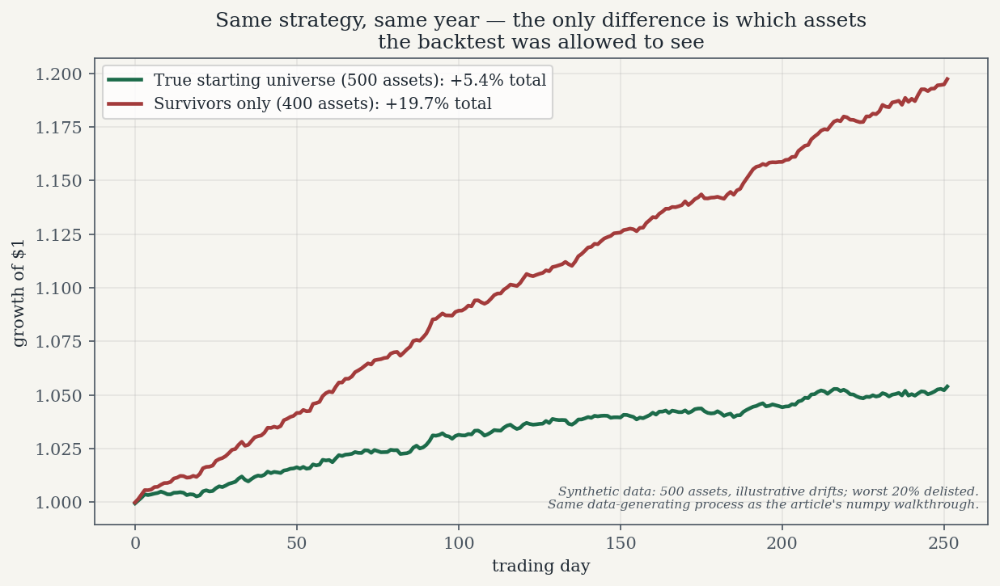
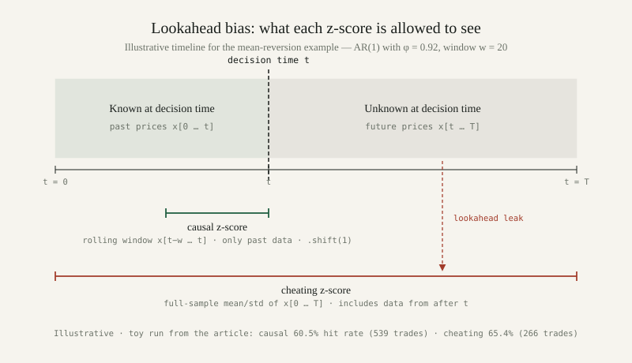

*By [Abdulmalik Ajisegiri](/about)*

A backtest is a simulation of the past, and like every simulation it is only as honest as its assumptions. The two most common ways a backtest lies are survivorship bias and lookahead bias. They are different bugs with the same signature: a strategy that looks brilliant in the notebook and ordinary — or worse — in production. Both are easy to understand, easy to demonstrate, and distressingly easy to commit by accident. Here is each one, with code.

*(A note on the code and numbers in this article: everything below is my own illustrative reconstruction — toy simulations written to demonstrate the mechanisms, not a port of any real codebase and not empirical market research. Every number quoted is the output of the toy simulation shown, under the toy parameters shown. The magnitudes are exaggerated on purpose to make the bias visible; in real data the bias is subtler, which is exactly why it survives review.)*

## Survivorship bias: the losers get deleted

The setup for the classic failure: you download today's index constituents — say, the current S&P 500 list — pull their price history back ten years, and test your strategy on that basket. It looks great. The problem is that the basket you tested on is not the basket that existed ten years ago. Companies that went bankrupt, got acquired, or were dropped from the index are nowhere in your data. You simulated a world in which every loser had already been quietly removed, and then congratulated your strategy for picking winners.

The mechanism is pure selection: you conditioned on survival, and survival is correlated with returns. Any strategy evaluated on a survivors-only universe gets a free boost, because the left tail of the return distribution has been amputated before the first line of strategy code runs.

Here is the mechanism in numpy. Five hundred assets, one year of daily prices, each with its own (illustrative) drift. The "strategy" is the simplest one possible — equal-weight buy-and-hold — evaluated two ways: on the full starting universe, and on the survivors only, where the worst 20% by year-end price have been delisted:

```python
import numpy as np

rng = np.random.default_rng(20260920)

N = 500          # assets in the true starting universe (illustrative)
T = 252          # one year of daily prices
drift = rng.normal(0.0002, 0.0008, size=N)   # per-asset daily drift, illustrative
rets = rng.normal(drift[:, None], 0.02, size=(N, T))
prices = 100.0 * np.exp(np.cumsum(rets, axis=1))

# Illustrative delisting rule: the worst 20% by year-end price are gone --
# bankruptcies, take-privates, index removals. A backtest run on "today's"
# constituents never sees them.
total_ret = prices[:, -1] / prices[:, 0]
cut = np.quantile(total_ret, 0.20)
surv = total_ret > cut
print(f"Assets that survived the year: {surv.sum()} of {N}")

def ann_stats(r):
    mu_a = r.mean() * 252
    sd_a = r.std(ddof=1) * np.sqrt(252)
    return mu_a, sd_a, mu_a / sd_a

# Strategy: equal-weight buy-and-hold, rebalanced daily.
port_all  = rets.mean(axis=0)
port_surv = rets[surv].mean(axis=0)

for label, r in [("true universe", port_all), ("survivors only", port_surv)]:
    mu_a, sd_a, sh = ann_stats(r)
    print(f"{label:>14}: ann. return {mu_a:+.2%}, ann. vol {sd_a:.2%}, Sharpe {sh:+.2f}")
```

Output (illustrative toy run):

```
Assets that survived the year: 400 of 500
 true universe: ann. return +5.26%, ann. vol 1.32%, Sharpe +4.00
survivors only: ann. return +18.03%, ann. vol 1.32%, Sharpe +11.86
```



*Growth of $1 for the same equal-weight strategy run on the two universes, using the same synthetic data-generating process as the numpy walkthrough above. The only difference is which assets the backtest was allowed to see. Synthetic data, for illustration only.*

Same strategy, same data-generating process — the only difference is which assets the backtest was allowed to see. Annualized return more than triples, and the Sharpe nearly triples too. Notice the Sharpe gets a double lift: dropping the left tail raises the mean *and* compresses volatility, so the ratio inflates faster than either input. This is why survivorship bias is so flattering to precisely the statistic (risk-adjusted return) that investors trust most.

And the bias compounds. In practice nobody backtests one strategy once — you iterate, tweak parameters, and keep the version with the best Sharpe. Each iteration re-selects on the same survivors, so the number you finally publish is the maximum over many draws from an already-flattered distribution. Survivorship bias inflates the average; multiple testing inflates the maximum; together they manufacture track records out of noise. The defense against the second half is out-of-sample testing and honest accounting of how many variants you tried — but no amount of out-of-sample discipline fixes a universe that was wrong from the start.

In practice the bias hides in ordinary-looking choices: "top 100 coins by market cap" measured today, a fund database with dead funds removed, an "all stocks with complete data" filter (incomplete data is itself a marker of distress). The defense is a point-in-time universe: historical constituent lists as of each decision date, with delisted assets carried at their actual delisting proceeds — including the zeros. If your data vendor can't give you the dead, your backtest can't be trusted.

## Lookahead bias: peeking at the future

Lookahead bias is using information at decision time that wasn't available then. The blatant version is trading at today's open using today's close. The version that actually ships in production code is subtler: normalizing features with the full sample's mean and standard deviation, computing a "trailing" indicator with a centered window, or splitting time-series data into train/test randomly instead of chronologically.

The full-sample normalization case is worth demonstrating because it hides inside respectable advice. "Standardize your features" is good practice — applied to the whole dataset before the backtest loop, it leaks the future into every past decision. Here is a mean-reversion signal computed two ways on a mean-reverting (AR(1)) price series: a causal rolling z-score using only past data, and a cheating z-score using the full sample's mean and standard deviation:

```python
import numpy as np

rng = np.random.default_rng(4242)

T = 2000
phi = 0.92                      # AR(1) persistence: deviations decay slowly
x = np.zeros(T)
for t in range(1, T):
    x[t] = phi * x[t-1] + rng.normal(0, 1.0)

w = 20
roll_mean = np.array([x[t-w:t].mean() for t in range(w, T)])
roll_std  = np.array([x[t-w:t].std(ddof=1) for t in range(w, T)])
z_causal = (x[w:] - roll_mean) / roll_std          # only past data

z_cheat = (x[w:] - x.mean()) / x.std(ddof=1)       # full sample: sees the future

def hit_rate(z):
    # bet on reversion: enter when |z| > 1.5, hold one day,
    # win if the next move is back toward the mean
    enter = np.abs(z[:-1]) > 1.5
    next_move = x[w+1:T] - x[w:T-1]
    win = np.sign(next_move) == -np.sign(z[:-1])
    return win[enter].mean(), enter.sum()

for name, z in [("causal  ", z_causal), ("cheating", z_cheat)]:
    hr, n = hit_rate(z)
    print(f"{name} z-score: hit rate {hr:.1%} over {n} trades")
```

Output (illustrative toy run):

```
causal   z-score: hit rate 60.5% over 539 trades
cheating z-score: hit rate 65.4% over 266 trades
```



*Figure — point-in-time data availability for the causal vs cheating z-scores in the mean-reversion example. Illustrative.*

The cheating signal wins by about five percentage points of hit rate — not because the strategy is better, but because it knows the true center and spread of the series, including data from after each trade. Knowing the exact long-run mean makes entry timing cleaner: the cheat enters fewer, better trades. Five points of hit rate, compounded across hundreds of trades, is the difference between a strategy that survives transaction costs and one that doesn't. And the terrifying part is how innocent the bug looks in a notebook: `x = (x - x.mean()) / x.std()` on one line, months before the backtest loop.

The general rule: every feature must be computable from information timestamped at or before the decision. Rolling statistics get shifted by one period (`.shift(1)` in pandas — the most load-bearing method call in all of backtesting). Train/test splits for time series go in chronological blocks, never shuffled. And any preprocessing — normalization, imputation, outlier clipping — is fit on the past and applied forward, never fit on the whole sample.

## The discipline checklist

These four checks catch both killers and most of their cousins:

1. **Point-in-time data.** Every feature value must be the value as known at the decision timestamp — the announced earnings, not the restated ones; the index membership as of that date, not today's. If a data point was revised later, your backtest must use the unrevised vintage.
2. **Causal-only features.** No centered windows, no full-sample normalization, no statistics computed over data the strategy couldn't have seen. Shift rolling features by one observation and fit all preprocessing on past data only.
3. **Survivorship-free universes.** Use historical constituent lists and carry delisted assets at their actual exit proceeds, zeros included. "Complete data only" is a euphemism for "survivors only" — treat it as a bug until proven otherwise.
4. **Remember that paper trading still lies a little.** Even a bias-free backtest is an upper bound: fills are worse than mid-prices, slippage and market impact scale with size, latency eats fast signals, and fees compound. Worse, there is a meta-bias no checklist fully removes — you only paper-trade the ideas that backtested well, so your live portfolio is pre-selected for strategies whose backtests were lucky. Discount accordingly.

A backtest that survives this checklist will look worse than the naive version. That is the point. The naive version was never measuring your strategy — it was measuring your data pipeline's willingness to flatter you.

One last reason the checklist matters: position sizing. Risk models and Kelly-style sizing take the backtested Sharpe as an input, so an inflated Sharpe doesn't just flatter the pitch deck — it sizes real positions too large. Both of these biases propagate from the research notebook into dollars at risk, which is why they deserve to be caught with code, not with vibes.

## Related reading

- [When R² Lies: Evaluating Regression for High-Stakes Decisions](/research/when-r2-lies-regression-evaluation/)
- [Monte Carlo for Decisions Under Uncertainty](/research/monte-carlo-decisions-under-uncertainty/)
