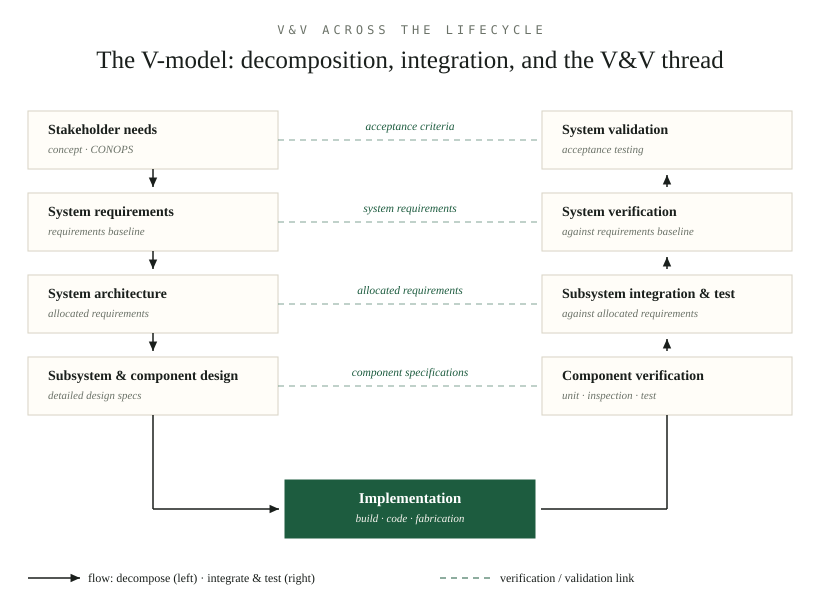

*By [Abdulmalik Ajisegiri](/about)*

Every engineering organization has a version of the same story: the system that passed every test and still failed in the field. Requirements met, coverage green, sign-off signed — and then reality delivered the one input nobody modeled, the one user nobody consulted, the one interface nobody owned. The postmortem almost never blames testing. It blames the *wrong kind* of confidence. This article is about how to build the right kind.

*The running example below is an illustrative toy system — a solar-powered soil-moisture sensor station deployed on a farm — chosen to keep the discussion concrete. Nothing in it describes a real program or product.*

## The distinction that matters

Verification and validation answer two different questions, and confusing them is one of the most expensive mistakes in systems engineering:

- **Verification** asks: *did we build the system right?* Does the implementation conform to its specified requirements?
- **Validation** asks: *did we build the right system?* Does the system, in its actual operating environment, satisfy stakeholder needs?

A system can pass verification completely and fail validation utterly — every requirement met, every test green, and the stakeholders reject it because the requirements described the wrong system. Verification without validation produces precision without relevance. Validation without verification produces good intentions without evidence.

Note what this implies: validation can't be fully completed until the system exists in something close to its real environment, operated by something close to its real users. Verification, by contrast, can and should happen continuously — against requirements, against design, at every level of integration.

## Four ways to verify: test, analysis, inspection, demonstration

IEEE Std 1012 — the long-standing reference for V&V terminology — organizes verification into four methods. Every verification activity you'll ever plan is one of these, or a combination:

| Method | What it does | When it's the right tool | Toy example |
|---|---|---|---|
| **Test** | Execute the item and compare observed behavior to expected | Behavior is observable and the environment can be controlled | Soak the sensor station's enclosure, verify readings stay within tolerance |
| **Analysis** | Evaluate by reasoning, calculation, or modeling — no execution | Testing is impractical, unsafe, or too expensive | Battery-life calculation proving 72-hour autonomy from the panel spec |
| **Inspection** | Examine the item visually or with instruments | Physical characteristics, workmanship, conformance to drawings | Verify the enclosure gasket is seated and fasteners are torqued to spec |
| **Demonstration** | Operate the item and observe — no instrumentation or measurement | Qualitative behavior: usability, access, basic function | A farmer walks up, reads the display, and changes a threshold without the manual |

Three consequences follow from the table. First, **testing is not V&V** — it's one quarter of verification. Teams that "do V&V" by testing everything are over-testing the testable, ignoring the untestable, and calling the coverage confidence. Second, each method catches a different defect class at a different price: inspection finds build defects cheapest, analysis finds design defects before anything is built, demonstration finds human-interface defects that no test script would script, and test finds behavioral defects under controlled stress. Third, the methods compose across levels: you might *inspect* a component, *analyze* its timing budget, *test* the integrated subsystem, and *demonstrate* the installed system.

The selection discipline is simple to state and hard to practice: for each requirement, pick the method that matches the requirement's nature and the consequence of it being wrong. A requirement like "the station shall report soil moisture within ±3%" wants test (it's quantitative and measurable). A requirement like "the station shall be maintainable by farm staff with hand tools" wants demonstration (it's experiential). Mismatched method is a silent V&V failure — the activity completes, the checkbox fills, and nothing was actually verified.

## Validation: the stakeholders' question

Validation methods mirror verification's pragmatism but aim at a harder target: *needs*, not requirements, and needs are often unstated, inconsistent, or wrong about themselves. The practical validation toolkit:

- **Stakeholder review of requirements and prototypes.** Structured walkthroughs where users react to something concrete — a mock-up, a simulation, a partial build — not to a requirements document. People are terrible at validating documents and good at validating experiences.
- **Operational scenarios.** Describe a day in the life of the system — installation, a week of operation, a failure, a maintenance visit — and ask stakeholders to confirm this is the system they meant. Scenarios validate *completeness*: the requirements no one wrote because everyone assumed.
- **Validation against the intended environment.** For our toy station: deploy prototypes to actual fields, with actual dust, actual irrigation schedules, actual users. The gap between the lab and the field is where validation lives or dies.
- **Acceptance testing.** The formal end of validation: agreed criteria, agreed environment, stakeholders witnessing. But acceptance criteria agreed at delivery are worthless — they must be negotiated during requirements, when disagreement is still cheap.

The recurring failure is validating the *specification* and calling it validation of the *system*. Requirements reviews are verification of the requirements against stakeholder needs — valuable, but one step removed. Real validation touches the system in its world.

## The V-model: a map of the thread

The V-model (see the diagram below) is the standard way to visualize how decomposition on the left mirrors integration and test on the right, with verification and validation links running horizontally across each level. Read it as a plan, not a schedule:

- **Down the left arm** — stakeholder needs are refined into system requirements, then architecture, then subsystem and component design. This is decomposition: each level allocates requirements to the next.
- **Up the right arm** — components are verified against component specs, integrated into subsystems verified against subsystem requirements, integrated into the system verified against system requirements, and finally validated against stakeholder needs.
- **The dashed links** — each right-arm activity verifies or validates against the *corresponding left-arm artifact*, not against its neighbor. System verification answers to system requirements, not to the architecture.
- **The vertex** — implementation: the build, the code, the fabrication. The model's central warning is that no V&V happens at the vertex itself; V&V happens on the arms, against the artifacts produced there.

The V is often drawn as if it were the whole lifecycle, but it's really a map of *verification planning*: it tells you, for each requirement level, what gets verified when, against what, and how. The lifecycle phases (concept, design, implementation, integration, operations) overlay it as the dimension of time; the V is the dimension of *evidence*.

*Figure — the V-model: decomposition down the left, integration and test up the right, with verification and validation links across each level.*

## Requirements must be verifiable

A requirement that cannot be verified is an unverified claim wearing a requirement's clothing. "The station shall be reliable" cannot be verified — reliable compared to what, measured how, under which conditions? "The station shall report moisture readings with no more than 1% data loss over any 30-day field deployment" can be: it's bounded, measurable, and the verification method (test, in the field) falls out of the wording.

Three rules of thumb keep requirements verifiable:

- **Quantify the behavior.** Replace adjectives with numbers and tolerances. "Fast" becomes "within 2 seconds of a threshold crossing"; "user-friendly" becomes "a trained operator completes the calibration procedure without the manual in under 10 minutes" — which is also demonstrable. If you can't put a number on it, you can't verify it, and everyone should know that before the design starts.
- **Bound the conditions.** "In the operating environment" is a wish; "at ambient temperatures from −10°C to 45°C and relative humidity up to 95%" is a test procedure waiting to happen. Unbounded requirements get verified against the tester's imagination, which is always kinder than reality.
- **Name the method with the requirement.** Writing "verify by test" or "verify by analysis" next to each requirement — while the requirement is being written — forces the question "how would we ever know?" early, when the requirement is still cheap to fix. A requirement whose verification method is still "TBD" at design review is a defect with a schedule.

This is where the cost-of-change curve bites hardest. A vague requirement discovered at acceptance doesn't just fail — it fails in a way that forces renegotiation of scope, schedule, and the stakeholder relationship all at once. Verifiability is the cheapest V&V activity there is: it's a sentence, written once, read by everyone.

## V&V across the lifecycle

**Concept and requirements phase.** V&V here means validating the requirements themselves: are they complete, consistent, verifiable, traceable to stakeholder needs? Techniques include requirements reviews, traceability analysis, prototyping to validate concepts with stakeholders, and modeling to check feasibility. Catching a bad requirement here costs orders of magnitude less than catching it in system test — the cost-of-change curve is the entire economic argument for early V&V.

**Design phase.** Design verification asks whether the architecture and detailed design satisfy the requirements allocated to them. Methods: design reviews, traceability analysis (every requirement allocated somewhere, every design element justified by a requirement), simulations, and analysis (timing analysis, reliability predictions, interface verification). This is also where test planning begins — verification requirements should be shaping the design while the design is still fluid, not discovered afterward.

**Implementation phase.** Unit and component verification: does each element do what its specification says? Code reviews, static analysis, unit testing, and inspection of non-software elements. The discipline here is matching the verification rigor to the criticality of the component — not everything deserves the same intensity, and pretending it does just spreads effort thin.

**Integration phase.** This is where interface assumptions go to die. Integration verification proceeds bottom-up: components into subsystems, subsystems into the system, each level verified against its allocated requirements before the next level is attempted. Interface testing deserves its own emphasis — a large share of integration failures are interface failures, and interfaces should be verified as early as possible, including with stubs and simulators before the real counterpart exists.

**System test and acceptance.** System-level verification against the full requirements baseline, in an environment as close to operational as achievable. Then validation: acceptance testing with stakeholders, operational test scenarios, and confirmation that the system solves the actual problem. Acceptance criteria should have been agreed during requirements — negotiating them at delivery is a sign the thread broke much earlier.

**Operations and maintenance.** V&V doesn't stop at delivery. Every change, patch, and upgrade needs regression verification; operational data feeds validation (is the system still meeting needs as the environment evolves?); and periodic revalidation catches the slow drift between what the system does and what stakeholders now need.

**Disposal and transition.** Often forgotten entirely. Decommissioning has requirements too — data migration, sanitization, continuity of service during transition — and they need verification like any others.

## Independent V&V

The fox shouldn't guard the henhouse, at least not alone. **Independent verification and validation (IV&V)** — V&V performed by an organization separate from the development team — exists because developers are systematically bad at finding their own errors. They test what they intended to build, not what they built; they share the development team's blind spots and schedule pressures.

Independence comes in degrees, from a separate test team within the same organization to a fully independent contractor. The right degree depends on criticality: for safety-critical or high-consequence systems, genuine organizational independence with its own reporting chain is the standard. For lower-consequence work, separate personnel with separate accountability may suffice.

What independence must not become is isolation. IV&V works when the independent team engages early — reviewing requirements and design, not just testing the finished product. An independent team that first sees the system at acceptance testing can find bugs, but it can't fix the requirements errors that are already cast in concrete.

## Traceability: V&V's infrastructure

Traceability is what makes V&V more than a pile of test reports. The chain runs: stakeholder need → requirement → design element → implementation → verification activity → result. For the toy station, one link of the chain might read:

> *Need:* "I need to know when to irrigate" → *Requirement:* "The station shall report volumetric soil moisture within ±3% at 15 cm depth" → *Design:* capacitive probe X, calibrated per the moisture-calibration procedure → *Implementation:* probe unit SN-042 → *Verification:* test per procedure TP-117 in the environmental chamber → *Result:* ±2.1%, passed.

Breaks in this chain are V&V findings in themselves:

- A requirement with no verification activity is an unverified claim.
- A verification activity with no parent requirement is effort without purpose (or a requirement that was never written down).
- A design element with no parent requirement is scope without a customer.

Coverage analysis over these links — run regularly, not once before delivery — is one of the cheapest and most effective V&V activities available. It finds the gaps that testing never will, because testing can only check what someone thought to test.

## V&V planning and reporting

V&V needs its own plan, written early: what will be verified and validated, by whom, using what methods, in what environments, to what criteria, and on what schedule. The plan should be risk-driven — verification intensity follows consequence of failure, not uniformity. A credible plan also defines entry and exit criteria for each V&V activity: under what conditions do we start, and what constitutes "done"?

Reporting should answer three questions for decision-makers: what was verified/validated, what were the results (including failures and their disposition), and what residual risk remains. That last one is the point. V&V doesn't prove a system is correct — it builds a structured, evidence-backed understanding of where confidence is warranted and where it isn't. A V&V report that claims everything passed and mentions no limitations is either describing a trivial system or an unserious process.

The thread leaves an evidence package behind, and its quality is a direct measure of the V&V process: the plan itself, the requirements traceability matrix with verification methods assigned, the procedures (detailed enough that a different person could re-run them and get the same result), the raw results, anomaly reports with dispositions (fixed, waived with rationale, deferred with a risk note — "waived" without rationale is just a failure with better paperwork), and the final report tying it together. If a future team — or a future you, six months later — can't reconstruct what was checked and what was found, the V&V happened to the project, not for it.

## Calibrating rigor to consequence

Not every requirement deserves the same verification intensity, and pretending they do is how V&V budgets evaporate on the trivial while the dangerous goes under-checked. Rigor should follow **consequence of failure times uncertainty** — the requirements whose violation would hurt most, and whose correctness you're least sure of, get the independent eyes, the harshest tests, the formal analysis. Everything else gets proportionally less.

For the toy station, the moisture-accuracy requirement earns full rigor: it's the product's entire reason to exist, the sensor physics are subtle, and a wrong reading silently corrupts irrigation decisions for a season. The enclosure-color requirement earns inspection at receiving and nothing more. The art is defending that asymmetry in the plan, because every stakeholder believes their requirement is the important one — until you show them the consequence ranking.

This is also the honest answer to "how much V&V is enough?" Enough is not a number of tests; it's the point where the residual-risk statement in your report describes risks the decision-maker knowingly accepts rather than risks nobody measured. When the V&V report's open items are all consciously accepted, you're done. When they're unknown unknowns, you're not.

## Common failure modes

- **Testing as the only V&V.** Reviews, inspections, analysis, and traceability are V&V too — and they catch different defect classes, earlier and cheaper.
- **Verifying against the design instead of the requirements.** Testing that the system does what the design says, when the design doesn't match the requirements, verifies the wrong thing.
- **Environment infidelity.** Verifying in an environment that doesn't represent operations, then being surprised by operational failures. The gap between test and reality is where risk hides.
- **No regression discipline.** Changes verified in isolation while the system they integrate into is assumed unchanged. Every change re-opens verification obligations.
- **Validation deferred to delivery.** Discovering at acceptance that the requirements were wrong is the most expensive possible time to learn it. Validate early with prototypes, models, and stakeholder reviews.
- **Uniform rigor.** Spreading the same verification intensity across every requirement guarantees the critical ones are under-verified and the trivial ones over-verified. Calibrate to consequence.
- **V&V evidence that can't be re-run.** Procedures written from memory after the fact, results without the configuration that produced them, waivers without rationale. If the evidence doesn't survive the people who made it, it isn't evidence.

## The thread, not the gate

V&V done right is continuous, risk-driven, independent where it counts, and traceable end to end. It's not the gate at the end of the process — it's the thread that runs through it, the mechanism by which a project maintains an honest, evidence-backed understanding of what it built and whether it was worth building. Projects that treat V&V as a phase get testing. Projects that treat it as a thread get confidence.

## Related reading

- [Validating Models Like a Skeptic: The Outcomes-Analysis Playbook](/research/validating-models-like-a-skeptic/)
- [From Stakeholder Needs to Verification: Requirements Engineering for Complex Systems](/research/requirements-engineering-complex-systems/)
- [Model-Based Systems Engineering and Requirements Traceability](/research/mbse-requirements-traceability/)
