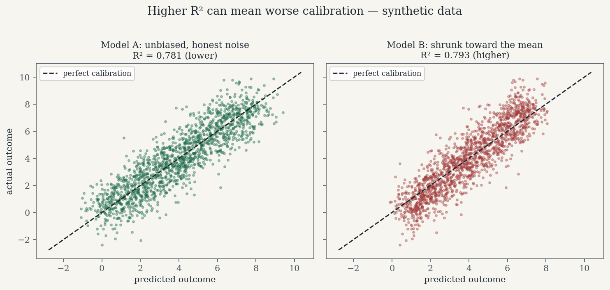

*By [Abdulmalik Ajisegiri](/about)*

*This article is grounded in a public project of mine, [cardiac-surgery-predictive-model](https://github.com/Maleek23/cardiac-surgery-predictive-model): an ML-based clinical support tool that predicts postoperative risk in cardiac surgery — operative mortality, renal failure, prolonged ventilation, stroke — from preoperative patient data, designed in alignment with Society of Thoracic Surgeons (STS) database standards. Both R² figures quoted below come from that project's README (0.78 for the main.py model; 0.81 for the stacked model, reported for the TAVR variant). The code below is an illustrative reconstruction of the evaluation pattern, not a verbatim dump of the repo.*

The cardiac risk project's README reports R² of 0.78 for the main Gradient Boosting model and 0.81 for the stacked Random Forest + Gradient Boosting ensemble. The stacking gain is real — measured honestly, on held-out data, with a diverse base-learner pair. But here's the question nobody asks when the number goes up: **what does R² actually entitle you to believe?**

In a high-stakes setting, almost nothing. R² is a global, symmetric, squared-error statistic. Clinical decisions are none of those things. A model's job in that project isn't to explain variance — it's to support thresholded decisions: flag this patient for extra review, allocate that ICU bed, schedule the follow-up. This article is about the gap between "the score went up" and "the model is safe to trust," and the evaluation toolkit that closes it.

## What R² actually measures

R² has a precise definition, and the precision matters:

$$R^2 = 1 - \frac{SS_{res}}{SS_{tot}} = 1 - \frac{\sum_i (y_i - \hat{y}_i)^2}{\sum_i (y_i - \bar{y})^2}$$

It's the fraction of target variance your model explains **relative to the dumbest possible baseline: predicting the mean every time**. R² = 0.81 means the model's squared error is 19% of the mean-predictor's squared error. That's all.

Three things people forget about that definition:

1. **It's a comparison, not an absolute grade.** 0.81 tells you nothing about whether the residual 19% contains exactly the errors that kill people. And whether 0.81 is good depends on the noise floor — predicting a noisy biological process at 0.81 can be excellent, while predicting a near-deterministic quantity at 0.81 is a disaster. The number has no meaning without the domain's irreducible noise.
2. **You can't compare R² (or MSE) across different targets.** The same README reports MSE 0.04 for the main.py model and 0.12 for the TAVR model — those aren't comparable either, because they measure error on different targets with different scales and variances. Cross-model score comparisons are only valid on the same target, same split.
3. **In-sample R² is fiction.** A Gradient Boosting model can memorize its way to a gorgeous training R². Only out-of-sample (or properly cross-validated) R² counts, and even that is just the beginning of the evaluation, not the end.

## The four ways R² misleads

**1. Scale dependence.** Because R² is normalized by target variance, its meaning shifts with the target's spread. A model can show a higher R² on a noisier, wider-spread target while being less useful in absolute terms. Report R² alongside the raw error scale (MAE/RMSE in the target's units) or you're quoting a ratio with a hidden denominator.

**2. Outlier sensitivity.** Squared errors mean a handful of large misses dominate the score. A model can earn R² = 0.81 by nailing the easy middle of the distribution while being systematically wrong on the extreme-risk tail — which is precisely where clinical decisions live. R² rewards getting the bulk right; the tail is where the stakes are.

**3. Blindness to calibration.** This is the big one. R² rewards *ranking* — getting the ordering of predictions right. But a decision-maker needs *calibrated magnitudes*: when the model says risk 0.08, roughly 8% of such cases should have the event. A model can rank patients perfectly (great R²) while systematically underestimating absolute risk in the high-risk decile — and the threshold decision "flag for review" will then miss exactly the patients it exists to catch.

**4. Symmetric costs.** Squared error treats over-prediction and under-prediction identically. Underestimating operative mortality risk is not the same mistake as overestimating it — one leads to missed interventions, the other to unnecessary ones. If your loss function doesn't encode that asymmetry, your model optimizes the wrong objective, and R² can't even see the problem.

## Proof: a higher-R² model with worse calibration

Here's the failure mode made concrete. Two models predict a risk-related outcome on synthetic data. Model A is unbiased but noisy. Model B is shrunk toward the mean — its errors are smaller on average (higher R²), but it's systematically miscalibrated: it underestimates high-risk cases and overestimates low-risk ones.

```python
import numpy as np
from sklearn.metrics import r2_score

rng = np.random.default_rng(42)
n = 5000
x = rng.uniform(0, 1, n)
y = 8 * x + rng.normal(0, 1.0, n)          # true outcome: linear in risk factor + noise
y_mean = y.mean()

# Model A: unbiased signal, honest noise
pred_a = 8 * x + rng.normal(0, 0.63, n)

# Model B: shrunk toward the mean — smaller errors, systematic miscalibration
pred_b = 0.85 * (8 * x) + 0.15 * y_mean + rng.normal(0, 0.4, n)

print(f"R2 A: {r2_score(y, pred_a):.3f}   R2 B: {r2_score(y, pred_b):.3f}")

# --- Calibration check: decile bins of predicted value ---
def calibration_table(y_true, y_pred, bins=10):
    order = np.argsort(y_pred)
    qs = np.array_split(order, bins)
    rows = []
    for q in qs:
        rows.append((y_pred[q].mean(), y_true[q].mean()))
    return rows

print("\nbin | mean pred | mean actual  (A)      bin | mean pred | mean actual  (B)")
ta, tb = calibration_table(y, pred_a), calibration_table(y, pred_b)
for i, ((pa, aa), (pb, ab)) in enumerate(zip(ta, tb)):
    print(f"{i:3d} | {pa:9.2f} | {aa:11.2f}        {i:3d} | {pb:9.2f} | {ab:11.2f}")
```

Typical output: Model B scores the higher R² (~0.79 vs ~0.78), yet its calibration table shows the signature of shrinkage bias — in the top decile, mean actual outcome (7.43) exceeds mean prediction (7.16); in the bottom decile, the model overestimates (predicted 0.85 vs actual 0.52). Model A, with the *lower* R², is calibrated: predicted and actual means track each other across every decile. If a threshold decision is made on these scores ("flag patients predicted above some level"), Model B systematically understates the highest-risk cases while looking better on the leaderboard metric. That is R² lying.



*Predicted vs. actual outcome on the same synthetic setup as the code above (seed 42). Model B scores the higher R² — and its points are tilted steeper than the calibration diagonal, the signature of shrinkage: at the high-risk end, actual outcomes exceed the predictions. Synthetic data, for illustration only.*

## The replacement toolkit, part 1: calibration

For regression, calibration means: conditional on the model predicting value *p*, the expected actual outcome should be *p*. Check it the way the snippet above does — bin predictions (deciles or equal-width intervals), and compare mean predicted vs. mean actual per bin. Plot it:

```python
import matplotlib.pyplot as plt

def calibration_curve_reg(y_true, y_pred, bins=10, label="model"):
    order = np.argsort(y_pred)
    qs = np.array_split(order, bins)
    mp = np.array([y_pred[q].mean() for q in qs])
    ma = np.array([y_true[q].mean() for q in qs])
    plt.plot(mp, ma, "o-", label=label)
    return mp, ma

calibration_curve_reg(y, pred_a, label="A: unbiased, lower R2")
calibration_curve_reg(y, pred_b, label="B: shrunk, higher R2")
lims = [y.min(), y.max()]
plt.plot(lims, lims, "k--", label="perfect calibration")
plt.xlabel("mean predicted"); plt.ylabel("mean actual")
plt.legend(); plt.title("Regression calibration: decile bins")
plt.show()
```

A curve hugging the diagonal is a calibrated model. Model B's curve will bow away from the diagonal at both ends — overconfident compression, the classic fingerprint of a model that's been optimized for squared error at the expense of honest magnitudes. For classification-flavored risk outputs, `sklearn.calibration.calibration_curve` does the same job; the idea is identical. Also compute a summary number: the mean absolute gap between bin-level predicted and actual means (a regression analogue of expected calibration error). No model that touches a clinical decision ships without this plot in my reviews.

## The replacement toolkit, part 2: MAE and RMSE have different cost semantics

R²'s squared-error heritage hides a choice. RMSE and MAE aren't just two error numbers — they encode different beliefs about what an error *costs*:

- **RMSE** penalizes large errors quadratically. Minimizing RMSE targets the **conditional mean**. Use it when big misses are disproportionately bad — which, in risk modeling, they usually are.
- **MAE** penalizes errors linearly and is robust to outliers. Minimizing MAE targets the **conditional median**. Use it when you want the "typical" error and don't want a few wild rows driving model selection.

Report both, in the target's units, and know which one your decision cares about. A model selected on RMSE can differ from one selected on MAE — that disagreement is information, not noise. And neither one fixes the symmetry problem, which is why the next tool exists.

## The replacement toolkit, part 3: cost-aware thresholds

A risk model's output becomes a decision at a threshold: flag if predicted risk ≥ *t*. The default *t* = 0.5 (or any round number) is a confession that you didn't think about costs. The threshold should minimize **expected decision cost**:

$$\text{Cost}(t) = C_{FN} \cdot P(\text{miss at } t) + C_{FP} \cdot P(\text{false alarm at } t)$$

where the costs are illustrative here — in a real deployment they'd come from the clinical workflow, not from me. A missed high-risk flag costs far more than a false alarm that triggers an extra review:

```python
# Illustrative costs only — real values come from the clinical workflow.
C_FN, C_FP = 10.0, 1.0   # missing a high-risk case costs 10x a false alarm

rng_c = np.random.default_rng(7)
n_c = 20000
x_c = rng_c.uniform(0, 1, n_c)
y_c = 8 * x_c + rng_c.normal(0, 1.0, n_c)
# risk score: informative but noisy, so the tradeoff is genuine
score_c = y_c + rng_c.normal(0, 2.5, n_c)
risk = 1 / (1 + np.exp(-(score_c - y_c.mean()) / 2.0))
high_risk = (y_c > np.quantile(y_c, 0.8)).astype(int)

thresholds = np.linspace(0.05, 0.95, 91)
costs = []
for t in thresholds:
    flag = (risk >= t).astype(int)
    fn = ((flag == 0) & (high_risk == 1)).mean()
    fp = ((flag == 1) & (high_risk == 0)).mean()
    costs.append(C_FN * fn + C_FP * fp)

t_star = thresholds[int(np.argmin(costs))]
i50 = int(np.argmin(np.abs(thresholds - 0.5)))
print(f"cost-optimal threshold (10:1 costs): {t_star:.2f}  (vs naive 0.50)")
print(f"expected cost at 0.50: {costs[i50]:.3f}, at optimum: {min(costs):.3f}")
```

With a 10:1 cost ratio, the optimal threshold lands below 0.5 — you accept more false alarms to buy fewer misses. Rerun the same sweep with 1:1 costs and the optimum jumps to ~0.89: with no asymmetry, you flag only the clearest cases. Change the ratio and the threshold moves; that's the point. The threshold is a policy decision, not a model property, and it should be recomputed whenever costs or the population change. In the cardiac project context, this is the analysis that turns "the model predicts risk" into "flag patients above *t* for surgical review" — the only form in which a model actually touches a decision.

## The replacement toolkit, part 4: honest uncertainty intervals

Point predictions without uncertainty are overconfident by construction. Two practical ways to attach intervals:

**Quantile regression** — train models for the conditional quantiles directly (e.g., `GradientBoostingRegressor(loss="quantile", alpha=0.05/0.95)` gives a 90% prediction interval). The interval width adapts to heteroscedasticity: wider where the data is noisier.

**Conformal prediction** — the simplest honest interval. Hold out a calibration set, compute absolute residuals, and take the (1−α) quantile as the margin:

```python
from sklearn.model_selection import train_test_split

Xc = x.reshape(-1, 1)
X_tr, X_cal, y_tr, y_cal = train_test_split(Xc, y, test_size=0.3, random_state=0)

from sklearn.ensemble import GradientBoostingRegressor
m = GradientBoostingRegressor(random_state=0).fit(X_tr, y_tr)

resid = np.abs(y_cal - m.predict(X_cal))
alpha = 0.10
q = np.quantile(resid, 1 - alpha)          # 90% conformal margin

x_new = np.array([[0.9]])                  # a high-risk-looking case
p = m.predict(x_new)[0]
print(f"point prediction: {p:.2f}  |  90% interval: [{p - q:.2f}, {p + q:.2f}]")
# Coverage guarantee: P(y_new in interval) >= 1 - alpha, under exchangeability.
```

The conformal guarantee is the rare honest one in ML: under exchangeability of the calibration and future data, the interval covers the true value with probability at least 1−α, **regardless of how wrong the model is**. When it breaks (distribution shift — new patient population, new procedure mix), it breaks loudly: coverage drops and your monitoring catches it. That's a feature.

## Evaluate decisions, not points

Here's the closing principle: **a model that touches clinical decisions must be evaluated on decisions, not point accuracy.** The evaluation report for a model like the cardiac risk tool shouldn't lead with R². It should lead with:

- Calibration curves on held-out data, especially in the high-risk tail.
- The cost-optimal decision threshold, the assumed cost ratio, and who signed off on it.
- Interval coverage: does the 90% interval actually cover ~90% on new data?
- Subgroup slices: performance for the highest-risk decile, by procedure type, by age band. An aggregate 0.81 can hide a 0.55 where it matters.
- Residual behavior: the README's optional Yeo-Johnson transformation was aimed at exactly this — residuals that behave make every downstream number more trustworthy.

R² 0.78 → 0.81 is a fine headline for "the stack helped." It's a terrible basis for "the model is safe." The stacking gain buys variance reduction; calibration checks, cost-aware thresholds, asymmetric error analysis, and subgroup evaluation buy trust. Measure the first to pick the model. Do the second before anyone acts on it.

## Related reading

- [Stacking Ensembles That Actually Generalize: Lessons from Clinical Risk Modeling](/research/stacking-ensembles-clinical-risk-modeling/)
- [Validating Models Like a Skeptic: The Outcomes-Analysis Playbook](/research/validating-models-like-a-skeptic/)
- [Survivorship Bias and Lookahead: Two Backtest Killers, with Code](/research/survivorship-bias-lookahead-backtest-killers/)
