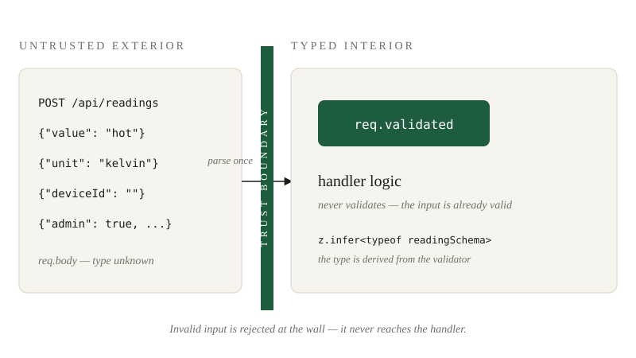
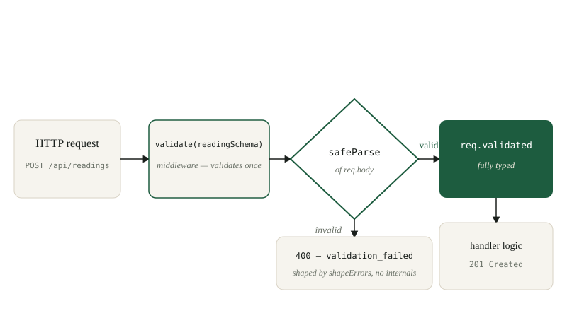

*By [Abdulmalik Ajisegiri](/about)*

> **Companion repository:** [Zawiyahh-DataBank](https://github.com/Maleek23/Zawiyahh-DataBank)

## Your types evaporate at runtime

TypeScript gives you a comforting fiction: the interface you wrote for your request body describes the data that arrives. It does not. Types are erased at compile time, and the payload hitting your Express route is whatever a client decided to send — a string where a number should be, a missing field, a nested object with fourteen extra keys, or something actively hostile. Anything your handler assumes about `req.body` without checking is an assumption about untrusted input, and untrusted input should never drive logic directly.

This is the core idea: **runtime validation belongs at the trust boundary**. In Zawiyahh-DataBank — a React + TypeScript + Tailwind frontend backed by an Express API (with Zod and MVP in-memory storage on the backend) — every byte that enters the system passes through a Zod schema before it touches any handler logic. The handler never defends itself; the boundary does it once, for everyone.

*(A note on the code: the snippets below are illustrative reconstructions of the documented stack — Express routes validated by Zod, the same pattern the project's backend uses — not verbatim repo lines. They show the patterns, not the actual files.)*


*Figure — The trust boundary: everything outside is untrusted; the schema admits only valid data.*

## Fail closed, fail once

Most hand-rolled validation fails open. Consider the shape of the bug:

```ts
app.post("/api/readings", (req, res) => {
  const value = req.body.value;          // number? string? undefined?
  const avg = value + lastAvg / 2;       // garbage in, garbage out
  readings.push({ value, ts: Date.now() });
  res.json({ ok: true });
});
```

Nothing here rejects a bad payload. `value` might be `"hot"`, and now you have a string in your in-memory store that downstream code treats as a number. The failure won't surface where it was caused — it surfaces two services later, in a chart that renders `NaN`, and you'll spend an hour tracing it back to a request nobody inspected.

Fail-closed design inverts the default: **a request is rejected unless proven valid**. The validation layer sits between the router and the handler, and the handler's contract is simple — "by the time you run, the input is correct." That separation is what makes the rest of this pattern work.

## Define the schema as the contract

Zod schemas are runtime truth with a TypeScript type derived for free, which is exactly the right direction: derive the static type from the runtime validator, not the other way around. A sensor-reading ingestion endpoint might look like this:

```ts
import { z } from "zod";

const readingSchema = z.object({
  deviceId: z.string()
    .min(1, "deviceId is required")
    .max(64, "deviceId too long")
    .regex(/^[a-zA-Z0-9_-]+$/, "deviceId contains illegal characters"),
  value: z.number()
    .finite("value must be a finite number"),
  unit: z.enum(["celsius", "fahrenheit", "percent", "ppm"]),
  recordedAt: z.string()
    .datetime({ offset: true })
    .optional()
    .refine(
      (s) => !s || new Date(s).getTime() <= Date.now() + 60_000,
      "recordedAt cannot be more than a minute in the future"
    ),
});
```

Notice what the schema carries: not just shapes, but *intent*. `.refine` on `recordedAt` encodes a domain rule (no future timestamps beyond clock skew) that a plain `string` type could never express. `z.enum` closes the set of legal units at the boundary, so the handler never needs a `default:` branch for an unknown unit. This is validation as documentation — anyone reading the schema knows exactly what the API accepts.

For polymorphic payloads, **discriminated unions** keep the boundary honest about variant shapes:

```ts
const configUpdateSchema = z.discriminatedUnion("op", [
  z.object({ op: z.literal("set-threshold"), channel: z.number().int().min(0), threshold: z.number() }),
  z.object({ op: z.literal("rename"), channel: z.number().int().min(0), name: z.string().min(1).max(40) }),
  z.object({ op: z.literal("reset"), channel: z.number().int().min(0) }),
]);
```

The `op` field dispatches to exactly one variant. A payload with `op: "set-threshold"` but no `threshold` fails; a payload with `op: "self-destruct"` fails. Polymorphism without a discriminator is a guess; with one, it's a contract.

## The middleware pattern: validate once, get `req.validated` downstream

The mistake to avoid is validating inside every handler. Validation logic scattered across routes drifts — one route forgets, one route checks differently, one route checks after using the value. The fix is a single middleware factory:

```ts
import type { Request, Response, NextFunction } from "express";
import type { ZodSchema } from "zod";

declare global {
  namespace Express {
    interface Request {
      validated?: unknown;   // narrowed by the factory's generic
    }
  }
}

export function validate<T>(schema: ZodSchema<T>) {
  return (req: Request, res: Response, next: NextFunction) => {
    const result = schema.safeParse(req.body);
    if (!result.success) {
      res.status(400).json(shapeErrors(result.error));
      return;
    }
    req.validated = result.data;
    next();
  };
}
```

With a small generic refinement, the handler gets a fully typed payload with zero casts:

```ts
app.post("/api/readings", validate(readingSchema), (req, res) => {
  // TypeScript knows: req.validated is { deviceId, value, unit, recordedAt? }
  const reading = req.validated as z.infer<typeof readingSchema>;
  readings.push({ ...reading, receivedAt: Date.now() });
  res.status(201).json({ ok: true });
});
```

The handler's first line of defense is a schema, and the handler itself does no defending at all. That division of labor is the whole point: every route in the API gets identical, tested validation behavior from one factory, and the type the handler sees is *derived from the validator*, so the runtime and the compiler can never disagree.


*Figure — Validate once at the boundary: the handler only ever sees typed data.*

## Error shaping: structured 400s, no internals

A raw Zod error is a goldmine for an attacker and noise for a client. It contains schema internals, paths, and sometimes values you don't want echoed. Shape it before it leaves:

```ts
import { ZodError } from "zod";

function shapeErrors(err: ZodError) {
  return {
    error: "validation_failed",
    message: "The request body did not match the expected schema.",
    details: err.issues.map((issue) => ({
      field: issue.path.join(".") || "(root)",
      code: issue.code,
      message: issue.message,
    })),
  };
}
```

This gives clients exactly what they need to fix their request — which field, what's wrong — and nothing they don't. Three rules for error shaping:

1. **Never echo raw input verbatim** into error messages where it could land in logs or reflected XSS surfaces. Field paths and your own message strings are safe; user values are not.
2. **Never leak schema internals** — no `expected: "string", received: "undefined"` trivia beyond the field-level message, no stack traces, no file paths.
3. **Keep the shape stable.** Clients (and your own frontend, with its TanStack Query error handling) should be able to pattern-match on `error: "validation_failed"` forever, regardless of which field failed. The `details` array can evolve; the envelope should not.

## Coercion vs strict parsing: know which you want

Zod offers two doors: `z.parse` rejects what doesn't match; `z.coerce.number()` tries to convert. They serve different trust levels, and mixing them up is a real bug class.

**Strict parsing** is for machine-to-machine JSON where the client controls serialization: `{"value": "42"}` is malformed, full stop, because a client sending strings for numbers has a bug you want surfaced, not silently papered over. Coercing it hides the client's bug and teaches you that your API accepts sloppy input — until the day `"42"` is `"4O"` and coercion produces `NaN` through a code path you never tested.

**Coercion** is for data that genuinely arrives as strings through no fault of the client: query parameters (`?limit=25` is always a string), form-encoded bodies, URL segments. There, coercing with a schema is correct:

```ts
const listQuerySchema = z.object({
  limit: z.coerce.number().int().min(1).max(100).default(25),
  since: z.coerce.date().optional(),
});
```

The rule of thumb: coerce at the edges where the transport forces strings on you; parse strictly everywhere the client chose the representation. And when you coerce, still constrain — `z.coerce.number()` alone accepts `Infinity` and `NaN` shaped as strings; chain `.finite()`, `.int()`, and ranges.

## Test the boundary like an adversary

A schema you haven't attacked is a hypothesis. Fuzz the endpoint with malformed payloads and assert the status code and the error envelope, not just the happy path. Here's the case table I run against every validated route:

| Case | Payload | Expect |
|---|---|---|
| Missing required field | `{}` | 400, `details` names the missing field |
| Wrong type | `{"value": "hot"}` | 400, no coercion fallback |
| Extra fields | `{...valid, "admin": true}` | 400 (strict) or accepted-and-stripped (documented choice) |
| Empty string for required | `{"deviceId": ""}` | 400 via `.min(1)` |
| Injection strings | `{"deviceId": "<script>alert(1)</script>"}` | 400 via the character-class regex |
| Future timestamp | `recordedAt` = tomorrow | 400 via the refine |
| Null where object expected | `{"value": null}` | 400 |
| Wrong enum | `{"unit": "kelvin"}` | 400 naming the allowed set |
| Massive payload | 10 MB of nested arrays | 400 or 413 before Zod even runs (body-parser limit) |
| Array where object expected | `[1, 2, 3]` as the body | 400 |

Two of these deserve emphasis. **Extra fields** is a design decision, not an accident: `.strict()` rejects unknown keys (fail closed — my default for config and command endpoints), while the default strips them. Either is defensible, but "I didn't think about it" is not a position. **The massive payload** is a reminder that Zod validates in memory, after the body is parsed — so set `express.json({ limit })` sanely. Validation doesn't help if parsing the payload exhausts memory first.

A supertest sketch for the table:

```ts
import request from "supertest";

it("rejects a wrong-typed value without coercion", async () => {
  const res = await request(app)
    .post("/api/readings")
    .send({ deviceId: "mic-1", value: "hot", unit: "celsius" });
  expect(res.status).toBe(400);
  expect(res.body.error).toBe("validation_failed");
  expect(res.body.details[0].field).toBe("value");
});
```

Run the whole table in CI. When someone loosens a schema, the table catches it.

## The principle

Every input path in your system — HTTP bodies, query strings, WebSocket messages, CLI args, UART lines — is a trust boundary, and every one of them deserves the same discipline: define the acceptable shape as data, enforce it before any logic runs, and make the enforcement identical everywhere through one mechanism. TypeScript tells you what the shape *should* be; Zod checks what it *is*. Your handler's first line of defense is a schema — because an API that trusts its input is a vulnerability with documentation.

## Related reading

- [Codifying Engineering Judgment: What an Automated Code-Review Pipeline Should Actually Check](/research/automated-code-review-pipeline/)
- [Low-Power Embedded Design on the TM4C123: Hibernation, EEPROM Persistence, and a UART CLI That Validates Everything](/research/low-power-embedded-design-tm4c123/)
